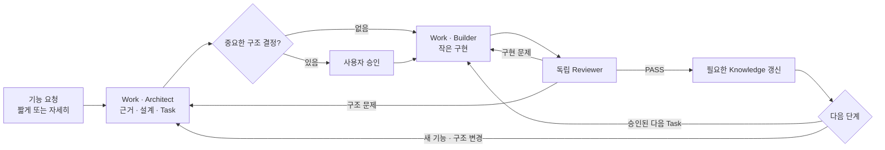
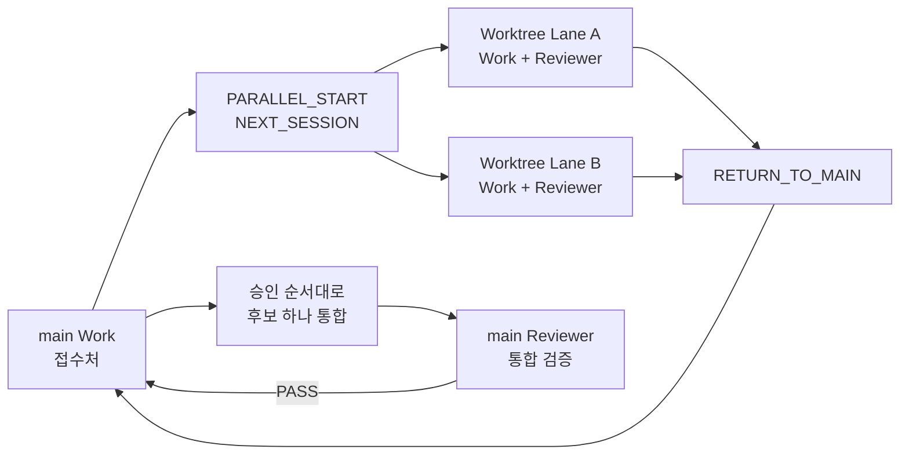

# AI Dev Workflow

[](https://github.com/yeomin-yoon/AI-Dev-Workflow/actions/workflows/validate.yml)
[](https://github.com/yeomin-yoon/AI-Dev-Workflow/actions/workflows/release-evidence.yml)
[](LICENSE)

*A file-backed AI development workflow for durable context, small verified changes, independent review, and human-controlled decisions.*

**파일에 상태를 남기고, 작게 구현하고, 독립적으로 검증하는 AI 협업 개발 워크플로우입니다.**

채팅 기억 대신 프로젝트 파일과 Git을 작업 상태의 기준으로 사용한다. 세션이나 AI 도구가 바뀌어도 작업을 복원하고, 중요한 판단은 사람이 통제하며, `설계 → 작은 구현 → 독립 검증 → 필요한 지식 갱신`을 반복한다.

저장소에 접근할 수 있는 AI로 실제 프로젝트를 개발하면서 세션 교체로 인한 상태 유실, 과도한 변경 범위, 작성 세션의 자기승인을 줄이려는 개발자를 위한 Workflow다.

> 사용자는 원하는 만큼만 설명한다. Work는 제공된 의도를 보존하고, 프로젝트 파일에서 나머지 맥락을 채우며, 결과나 구조를 바꾸는 핵심 불확실성만 질문한다.

| 흔한 AI 개발 문제 | AI Dev Workflow의 대응 |
|---|---|
| 작업 상태가 채팅에만 남아 세션 교체 시 유실 | 파일과 Git에서 승인된 상태·결정·근거를 복원한다. |
| 큰 기능을 한 번에 수정해 실패 범위가 불명확 | 독립적으로 구현·검증 가능한 Task 단위로 반복한다. |
| 작성 세션이 자신의 결과를 그대로 완료 처리 | 별도 Reviewer가 실제 변경과 실행 근거를 검증한다. |

## 사용법

### 빠른 시작

> [!NOTE]
> 대상 프로젝트에는 MIT 고지를 포함한 **`.ai` 폴더만** 복사한다. 저장소 루트의 `.git`, `.github`, `tools`, `evals`, `maintenance`는 배포 저장소의 검증·감사·릴리스 관리용이며 설치물이 아니다.

1. 이 저장소의 `.ai` 폴더를 대상 프로젝트 루트에 복사한다. 기존 `.ai`가 있다면 먼저 백업한다.
2. AI 도구로 프로젝트 루트를 열고 **[창 1] Work** 세션에 아래 Prompt를 붙인다.
3. `READY`를 확인한 뒤 **[창 2] Reviewer** 세션을 새로 열어 Reviewer Prompt를 붙인다.

> [!IMPORTANT]
> 아래 Bootstrap Prompt는 각각 **새 세션의 첫 번째 사용자 메시지**로 수정 없이 보낸다. System Prompt·Custom Instructions·터미널 명령으로 넣지 않는다.
> 두 Prompt를 같은 대화창에 입력하거나 기존 세션의 역할을 바꿔 재사용하지 않는다.

**[창 1] Work — 먼저 만들고 초기화가 끝날 때까지 기다린다.** 이 세션은 파일 상태에 따라 Knowledge Maintainer → Architect → Builder 역할만 전환하며 Reviewer 역할은 하지 않는다.

```text
Read `.ai/BOOTSTRAP.md`. role=work, lane=main, session_mode=compact, user_language=ko. If lane `main` is missing, create it from `.ai/lanes/_template`. Initialize only if needed, restore durable state, and reply READY or BLOCKED.
```

**[창 2] Reviewer — Work 초기화가 끝나면 별도 세션으로 만든다.**

```text
Read `.ai/BOOTSTRAP.md`. role=reviewer, lane=main, session_mode=compact, user_language=ko. Restore durable state from files and reply READY or BLOCKED.
```

현재 차례가 아닌 세션도 `READY ... next=wait_for_...`로 대기하는 것이 정상이다. 아직 Task나 Build Result가 없다는 이유만으로 `BLOCKED`가 되지는 않는다.

### 기본 개발 흐름



<details>
<summary>실제 1분 사용 예시</summary>

```text
[창 1 · Work]
사용자: 로그인 기능 추가해야 해.
Work: 프로젝트 근거와 영향, 선택지, 추천안을 보여주고 중요한 구조 선택만 승인 요청
사용자: 추천안 승인해.
Work: 승인된 구조를 작은 Task로 나누고 현재 Task 구현
Work: RESULT=ready_to_review ... DO_NEXT session=reviewer say="현재 Build Result를 검증해."

[창 2 · Reviewer]
사용자: 현재 Build Result를 검증해.
Reviewer: 실제 변경과 실행 근거를 독립 검증한 뒤 PASS 또는 수정용 DO_NEXT 제공

[창 1 · Work]
사용자: PASS면 `계속 진행해.`, 수정이면 Reviewer의 DO_NEXT 문장을 그대로 붙여넣기
```

구조 선택이 없으면 Work는 승인 질문을 생략한다. 사용자는 내부 상태나 카드를 직접 작성하지 않고 생성된 `DO_NEXT`만 해당 창에 전달한다.

</details>

<details>
<summary>설치 조건과 초기화 확인</summary>

| 도구 능력 | 필요도 | 없을 때의 영향 |
|---|---|---|
| 프로젝트 루트의 파일 읽기·쓰기 | 필수 | 상태 복원과 결과물 저장을 할 수 없다. |
| 같은 프로젝트 폴더를 여는 별도 Work·Reviewer 세션 | 기본 구성에 필수 | 독립 Review가 불가능해져 검증 신뢰도가 낮아진다. |
| 빌드·테스트 등 터미널 명령 실행 | 강력 권장 | 사용자가 직접 실행해 근거를 전달해야 한다. |
| 프로젝트 자체 Git 저장소 | 강력 권장 | Worktree·후보 봉인·정확한 통합 검증을 사용할 수 없다. |

가능하면 최초 실행 전에 대상 프로젝트에 Git 기준 커밋 하나를 만든다. Git이 없어도 기본 사용은 가능하지만 Review 근거가 약해지고 Worktree·후보 봉인·통합 기능은 사용할 수 없다. PowerShell은 이 배포 저장소 자체를 검증할 때만 필요하다.

최초 초기화가 성공하면 응답은 대략 다음 형태이며 `initialization=complete`가 포함된다.

```text
READY role=work lane=main task=none phase=synced status=idle next=<다음 행동>
inputs=<최소 입력 경로>
initialization=complete updated=<갱신한 경로>
```

이때 `.ai/lanes/<lane>/lane.yaml`과 `.ai/lanes/<lane>/state.yaml`이 생성되어 있어야 하며, 최초 설치의 `<lane>`은 `main`이다. `BLOCKED`이거나 두 파일이 없다면 Reviewer를 만들기 전에 같은 Work 세션에서 누락 원인과 복구 방법을 요청한다. 이미 초기화된 프로젝트를 다시 열 때는 `initialization=complete`가 나오지 않아도 정상이다.

</details>

엄격한 역할 분리나 워크플로우 평가가 목적이면 아래 네 세션을 대신 사용할 수 있다. 같은 프로젝트 폴더에서 공용 Knowledge를 동시에 갱신하는 세션을 두 개 만들지는 않는다. 단, Worktree 모드를 시작하면 접수와 통합은 항상 별도의 `main` Work 세션이 담당한다.

<details>
<summary>엄격한 4세션 Prompt</summary>

최초 설치에서는 Knowledge Maintainer 세션만 먼저 만들고 `initialization=complete`가 포함된 `READY`를 확인한다. 이후 Architect·Builder·Reviewer 세션은 어느 순서로 만들어도 된다.

Knowledge Maintainer:

```text
Read `.ai/BOOTSTRAP.md`. role=knowledge_maintainer, lane=main, session_mode=strict, user_language=ko. If lane `main` is missing, create it from `.ai/lanes/_template`. Then, if it is uninitialized, complete BUILD; otherwise restore durable state without a broad scan. Preserve existing work and report the result.
```

Architect:

```text
Read `.ai/BOOTSTRAP.md`. role=architect, lane=main, session_mode=strict, user_language=ko. Restore durable state from files and reply READY or BLOCKED.
```

Builder:

```text
Read `.ai/BOOTSTRAP.md`. role=builder, lane=main, session_mode=strict, user_language=ko. Restore durable state from files and reply READY or BLOCKED.
```

Reviewer:

```text
Read `.ai/BOOTSTRAP.md`. role=reviewer, lane=main, session_mode=strict, user_language=ko. Restore durable state from files and reply READY or BLOCKED.
```

</details>

### 처음 보는 용어

| 용어 | 뜻 |
|---|---|
| Lane | 작업 소유 범위·상태·산출물을 분리하는 논리적 작업 흐름이다. 평소에는 `main` 하나만 사용하며, 병렬 개발 시 별도 Worktree·Branch와 연결될 수 있다. |
| Task | AI가 한 번에 구현·검증할 수 있게 나눈 작은 작업 단위다. |
| Build Result | Builder가 남기는 변경 경로·검증·위험 근거다. 코드 자체를 대신하지 않는다. |
| Knowledge | 채팅 기억이 아니라 파일에 저장된 프로젝트 사실·위치·출처 색인이다. |
| Integration | 검토·봉인된 비-`main` 후보를 `main`에 반영하고 다시 검증하는 절차다. |

### 자주 쓰는 복붙 문장

정해진 명령 문법은 없다. 아래 문장은 반복해서 쓰기 좋은 표준형이며, 같은 뜻의 자연어로 말해도 된다.

#### 개발

| 하고 싶은 일 | 입력할 세션 | 입력 |
|---|---|---|
| 기능 시작 | Work | `이 기능 짜야 해.` |
| Architecture 승인 | 질문한 Work/Architect | `이 Architecture를 승인해.` |
| 구현 결과 검증 | Reviewer | `현재 Build Result를 검증해.` |
| PASS 후 다음 Task | Work | `계속 진행해.` |
| Review 결과 처리 | `DO_NEXT`가 지정한 세션 | Reviewer가 생성한 `DO_NEXT` 문장을 그대로 붙여넣기 |

#### Knowledge·병렬 작업·세션

| 하고 싶은 일 | 입력할 세션 | 입력 |
|---|---|---|
| 프로젝트 변경 반영 | Work/Knowledge Maintainer | `변경사항 반영해줘: <추가한 문서·직접 수정한 코드·Git Pull/Merge>` |
| Worktree 병렬 작업 설계 | main Work/Architect | `캐릭터와 UI를 별도 Worktree에서 병렬 개발할 거야. 작업 경계를 설계하고 Lane별 시작 카드까지 만들어줘.` |
| 병렬 기준 커밋 완료 알림 | 위 요청을 시작한 세션 | `병렬 기준 커밋했어.` |
| 비-`main` 세션 종료·복귀 | 종료할 세션 | `마무리하고 main으로 복귀해.` |
| 불편 기록 후 복귀 | 종료할 세션 | `방금 불편도 Workflow 개선 후보로 기록하고 main으로 복귀해.` |
| 상태·라우팅 복구 | 현재 담당 세션 | `Read .ai/reference/OPERATIONS.md and handle this issue: <현재 문제>` |
| 수동 확인 안내 보완 | 요청한 Reviewer | `내가 정확히 무엇을 어떻게 확인해야 해?` |

`DO_NEXT`, `PARALLEL_START`, `NEXT_SESSION`, `RETURN_TO_MAIN`, `USER_ACTION`은 AI가 만들어 주는 복붙 카드다. 사용자가 직접 조립하지 않는다. `PREPARE_DELTA`와 `INTEGRATE`도 내부 절차이므로 표시된 다음 문장만 따르면 된다. 여러 줄이 필요한 병렬 시작·기록 취합·배포본 갱신은 아래 상세 절차의 복붙 블록을 사용한다.

기본 반복은 `Work에서 기능 요청 → 필요할 때 Architecture 승인 → Reviewer 검증 → PASS면 Work에서 계속 진행`이다.

<details>
<summary><strong>상황별 상세 사용법</strong> — Worktree·통합·종료·복구·업데이트</summary>

### 평소 개발

빠른 표의 `기능 시작 → 구현 결과 검증 → 결과별 다음 입력` 순서로 사용한다. 세부 규칙은 다음과 같다.

- **Architecture:** 중요한 구조 선택이 있을 때만 Work가 프로젝트 근거와 한국어 Decision Brief를 보여준다. 같은 세션에서 승인하거나 수정 요청하면 되며, 내부 `architecture.md`를 직접 읽을 필요는 없다. 승인 범위 안의 일반 Task는 다시 묻지 않고 한 개씩 구현한다.
- **Review:** `RESULT=ready_to_review`이면 Reviewer에서 검증한다. `pass`는 Work에서 계속 진행하고, `implementation`은 Work/Builder가 수정한다. 구조·외부 공개 계약 변경은 Work/Architect로 보내지만 산출물(artifact) 형식·상태 계약 문제는 해당 산출물의 작성 역할로 보낸다. 사용자는 분류를 다시 해석하지 말고 Reviewer가 생성한 `DO_NEXT`를 따른다. `BLOCKED owner=user`이면 안내된 단계를 수행한 뒤 같은 Reviewer에 결과를 전달한다.
- **설명과 갱신:** 동작이나 구조가 달라진 PASS에는 실제 Diff와 검증 근거를 사용한 짧은 `Change Brief`가 붙는다. 단순한 기계적 변경은 생략한다. Work는 필요한 Knowledge 갱신을 수행하거나 작은 변경을 다음 체크포인트까지 묶는다.
- **인계:** 다른 세션이 필요하면 `DO_NEXT session=... say="..."`가 생성된다. 병렬 작업에서는 `lane`과 `worktree`도 표시된다. 내부 `route`를 해석하지 말고 안내된 문장만 지정된 세션에 붙여넣는다.

### Knowledge 바로 사용

기본 2세션 구성에서는 Work에, 엄격한 4세션 구성에서는 Knowledge Maintainer에 짧게 말하면 된다.

파일을 추가하는 것만으로 자동 실행되지는 않으므로 `변경사항 반영해줘:` 뒤에 추가한 문서, 직접 수정한 코드, Git Pull/Merge 중 실제 변경만 짧게 알려준다. 새 세션이나 Bootstrap 재입력은 필요 없다. 프로젝트의 위치나 사실은 `무기 시스템 진입점이 어디야? 근거 경로만 알려줘.`처럼 일반 질문으로 물으면 된다.

### Worktree 병렬 시작

Worktree는 같은 Git 저장소의 다른 Branch를 별도 폴더에서 동시에 여는 기능이다. 평소에는 `main` Lane만 사용한다. 서로 겹치지 않는 기능을 실제로 동시에 개발할 때만 경계 설계를 요청하며, 기본 구성에서는 기존 `main` Work에, 엄격한 4세션 구성에서는 `main` Architect에 말한다.

Worktree 모드에서 `main` Work는 항상 **접수처(Front Desk)**다. 새 작업을 받아 Lane별 시작 카드를 발급하고, Worktree에서 돌아온 상태를 인수해 통합하거나 다음 세션 카드를 발급한다. 기존 `main` Work 세션이 살아 있으면 그대로 접수처가 되며, 교체하고 싶거나 문맥이 길어졌다면 `빠른 시작`의 고정 main Work Prompt로 새 세션을 열어 파일 상태에서 같은 역할을 복원한다. 엄격한 구성으로 경계를 설계했더라도 실제 Lane 구현과 리뷰는 각 Worktree 세션에서 수행한다.



> [!WARNING]
> 세션은 Bootstrap 뒤 하나의 Worktree·Lane에 고정된다. `NEXT_SESSION`을 받으면 표시된 대상 폴더를 열어 **새 세션**을 만들고 Prompt를 붙인다. 기존 세션에 다른 Lane Prompt를 넣어 재사용하지 않는다.

```text
캐릭터와 UI를 별도 Worktree에서 병렬 개발할 거야.
작업 경계를 설계하고 Lane별 시작 카드까지 만들어줘.
```

경계를 승인하고 안내된 기준 파일을 Git에 커밋한 뒤 요청을 시작한 같은 세션에 `병렬 기준 커밋했어.`라고 답한다. 기본적으로 각 Lane은 토큰과 세션 부담이 적은 Work+Reviewer 2세션으로 구성된다. 처음에는 main 접수처 Prompt와 Worktree 생성 명령까지 포함한 `PARALLEL_START`, 이후에는 필요한 새 세션만 담은 `NEXT_SESSION`이 나오므로 순서대로 복붙하며 `lane=main`을 직접 수정하지 않는다.

각 Lane은 기본적으로 안내된 Worktree 폴더의 새 Work·Reviewer 세션으로 운영한다. 별도 Lane도 엄격한 4세션으로 운영하려면 최초 요청 끝에 `각 Lane도 엄격한 4세션으로 만들어줘.`를 붙인다.

### 병렬 작업 통합

`integration_order`는 병렬 경계를 승인할 때 의존성을 고려해 함께 정한 안전한 통합 순서다. 예를 들어 `character → ui`라면 Character의 계약을 먼저 `main`에 넣고 검증한 뒤 UI를 넣는다. 이미 승인한 순서이므로 충돌·공유 계약 변경·범위 추가·새 증거가 없으면 다시 선택하지 않는다.

비-`main` Lane의 각 Task는 Builder가 해당 Task 변경만 담은 후보 커밋을 만든 뒤 Reviewer가 그 정확한 revision을 검토한다. PASS 후에는 현재 Lane의 Task·Build·Review·state만 담은 메타데이터 커밋으로 후보를 봉인한다. 이는 승인된 Worktree 전달 절차라서 매번 묻지 않으며, 사용자 변경이나 다른 경로는 포함하지 않는다.

Lane의 마지막 세션을 마무리하면서 나온 `RETURN_TO_MAIN`의 `DO_NEXT` 한 줄을 **main Work 세션**에 붙여넣는다. main Work는 검토된 후보 커밋·트리와 Lane 메타데이터 커밋이 일치하는지 확인한다.

봉인된 후보라면 승인 순서의 한 Lane만 반영하고, 병합 전후 revision을 기록한 뒤 main Reviewer로 보낼 정확한 `DO_NEXT`를 준다. 직접 실행할 수 없거나 커밋·권한·충돌 문제가 있으면 사용자가 해야 할 단계와 PASS 기준을 `USER_ACTION`으로 준다.

main Reviewer의 통합 검증이 PASS하면 Review와 통합 Queue 정보만 담은 체크포인트 커밋을 남긴다. 필요한 공용 Knowledge 갱신도 별도 Knowledge 체크포인트로 정리한 뒤 `DO_NEXT`에 따라 main Work로 돌아가 다음 Lane을 같은 방식으로 처리한다. 사용자는 통합 순서를 외우거나 매번 승인할 필요 없이 표시된 복붙 문장만 따르면 된다.

같은 Lane에서 다음 Task를 계속하더라도 통합 전의 기존 Worktree를 그대로 재사용하지 않는다. main 접수처가 현재 main 기준의 새 Branch·Worktree·세션 Prompt를 만들어 주며, 같은 Lane ID로 최신 코드와 Knowledge에서 이어간다. 더 할 일이 없으면 Lane은 `synced/idle`로 남고, Worktree 삭제나 Lane `retired` 처리는 별도 선택이다.

### 세션 종료와 교체

빠른 표의 `마무리하고 main으로 복귀해.`는 비-`main` 세션을 실제로 닫거나 교체할 때 사용하는 표준 명령이다. 현재 Architecture·Task·Build·Review 경로, 승인된 결정, 단계와 상태, 검증 결과, 열린 위험·차단 사유, 다음 역할·행동과 최소 입력 경로를 파일에 체크포인트한다.

전체 대화·숨은 추론은 저장하지 않는다. 종료 명령 자체도 새 Git 커밋·병합이나 아직 선택하지 않은 Knowledge 갱신을 실행하지 않는다. 후보·메타데이터 커밋은 그보다 앞선 Builder/Reviewer/Knowledge 절차에서만 생성된다.

| 이동 상황 | 해야 할 일 |
|---|---|
| 같은 Worktree·같은 Lane에서 현재 세션 계속 사용 | 종료하지 않고 그대로 계속한다. |
| 같은 Lane의 이미 열린 Work↔Reviewer 이동 | 표시된 `DO_NEXT`를 해당 세션에 바로 붙인다. main을 거치지 않는다. |
| 비-main 세션 종료·교체·Lane 이탈 | `마무리하고 main으로 복귀해.` → 나온 `DO_NEXT`를 main Work에 붙인다. |
| main 접수처 세션 자체 교체 | `빠른 시작`의 고정 main Prompt로 새 main 세션을 만든다. |

비-main 종료 결과에는 현재 Worktree·Lane·역할·세션 구성·Branch, 검토/봉인 revision, 변경 종류별 dirty 경로, Observation과 main 경로가 담긴 `RETURN_TO_MAIN`이 나온다.

main은 이 카드가 가리키는 파일과 Git을 직접 확인하고 다음 행동 하나를 선택한다. 새 세션이 필요하면 정확한 폴더·역할 Prompt·첫 요청까지 채운 `NEXT_SESSION`을 주므로 사용자는 과거 Prompt나 대화를 보관할 필요가 없다.

종료 시 Workflow 불편사항의 자동 기록 조건도 한 번 확인하지만, 근거가 분명한 문제만 `OBS-*.yaml`로 저장한다. 반드시 남기고 싶다면 빠른 표의 기록 후 복귀 문장을 사용한다.

결과의 `RETURN_TO_MAIN`에서 `observation=<path>`이면 현재 Worktree에 저장된 것이다. `none`이면 자동 기록 조건에 해당하지 않은 것이다. Observation만 남아 있는 `dirty` 상태는 봉인된 커밋의 병합을 막지는 않지만 Worktree 삭제는 막는다. AI Dev Workflow 배포 저장소로 자동 전송되지 않으므로 main은 삭제 가능 여부를 안내하기 전에 개선 기록의 보존 여부도 확인한다.

### 문제가 생겼을 때

정상 흐름에서는 사용하지 않는다. `BLOCKED`의 담당이 불명확하거나 상태 불일치·충돌·복구가 필요할 때만 사용한다.

```text
Read `.ai/reference/OPERATIONS.md` and handle this issue:
<현재 문제를 한 줄로 작성>
```

- `OUTCOME=resolved` → 정상 흐름으로 복귀
- `OUTCOME=routed` → 지정된 역할 세션으로 이동
- `OUTCOME=blocked owner=user` → 요청된 정보나 결정 제공

`owner=user`이면 왜 필요한지, 정확한 앱·경로·순서, PASS 기준, 복붙할 답변 형식과 대안이 함께 나와야 정상이다. 안내대로 확인한 뒤 그 요청을 만든 같은 세션에 결과를 답한다. `Editor/PIE 근거 제공`처럼 한 줄만 나오면 같은 세션에 `내가 정확히 무엇을 어떻게 확인해야 해?`라고 물어도 된다. Workflow는 사용자의 조치를 요구하기 전에 이 안내를 제공해야 한다.

### Workflow 개선과 업데이트

#### 유지보수용 복붙 문장

| 하고 싶은 일 | 입력할 곳 | 입력 |
|---|---|---|
| 불편사항 기록 | 아무 세션 | `방금 문제를 Workflow 개선 후보로 기록해줘.` |
| 여러 설치본 기록 취합 | 배포 저장소 세션 | `다음 설치본들의 Workflow 개선 기록만 이 배포 저장소에 취합해줘. sources: <경로들>` |
| 취합 기록 검토 | 배포 저장소 세션 | `취합된 Workflow 개선 기록을 검토하고 업데이트 후보를 정리해줘.` |
| Workflow 자체 검토 | 배포 저장소의 새 세션 | `Read maintenance/WORKFLOW_REVIEW.md and review the current Workflow. mode=changed user_language=ko` |
| 프로젝트 업데이트 확인 | 프로젝트 세션 | `Workflow 업데이트 확인해줘. source=<GitHub URL 또는 로컬 경로>` |
| 확인된 업데이트 적용 | 같은 프로젝트 세션 | `확인된 Workflow 업데이트 적용해줘.` |
| 배포용 `.ai` 갱신 | 배포 저장소의 새 세션 | `Read maintenance/RELEASE.md and run BUILD_RELEASE_COPY. sources: <경로들>` |
| 소스 커밋 후 릴리스 검토·Eval 확정 | 소스를 수정하지 않은 새 배포 저장소 세션 | `Read maintenance/RELEASE.md and run FINALIZE_RELEASE_EVAL for HEAD.` |

사용 중 놓치고 싶지 않은 문제가 있으면 어느 세션에서든 위의 불편사항 기록 문장을 입력한다.

명백한 오경로·가짜 BLOCKED·필수 안내 누락·반복 복구 실패처럼 증거가 있는 Workflow 문제는 역할이 작업을 멈추는 시점에 자동으로 중복 없이 기록한다. 일반 코드 버그나 한 번의 실수는 자동 기록하지 않는다. 기록될 때만 `WORKFLOW_OBSERVATION=<path>` 한 줄이 나온다.

`Workflow 자체 검토`는 프로젝트 코드를 리뷰하는 Reviewer와 다르다. 배포 저장소에서 목적·첫 사용·단계·책임·실패 복구·검증·효율·유지보수·보안을 종합 점검하고, 마지막에 자신의 첫 판정도 한 번 역검증하는 읽기 전용 절차다. 누락·오탐·개수/결론 모순을 고칠 수 있지만 무한 재검토는 하지 않으며, 파일 수정이나 릴리스를 자동으로 수행하지 않는다. 기본 복붙문은 `changed`이고, 첫 기준선·대규모 재설계·정기 감사에만 `mode=full`로 바꾼다. 공개 릴리스에서는 소스를 작성하지 않은 새 `FINALIZE_RELEASE_EVAL` 세션이 깨끗한 커밋을 검토하고 자기검증 결과까지 release Eval에 함께 보존한다.

<details>
<summary>여러 프로젝트·Worktree의 개선 기록 취합</summary>

기록은 서로 자동 공유되지 않는다. 별도 **AI Dev Workflow 배포 저장소**를 열고 설치본 경로만 전달한다.

```text
다음 설치본들의 Workflow 개선 기록만 이 배포 저장소에 취합해줘.
sources:
- <프로젝트 또는 Worktree 경로>
- <프로젝트 또는 Worktree 경로>
```

`OBS-*.yaml`만 가져오며 재수집해도 중복 집계하지 않는다. 코드·Knowledge·Lane·Task·Eval과 Workflow Core는 변경하지 않는다. 취합 후 실제 개선 여부를 판단할 때만 말한다.

```text
취합된 Workflow 개선 기록을 검토하고 업데이트 후보를 정리해줘.
```

</details>

### GitHub용 `.ai` 복사본 갱신

개발 프로젝트의 `.ai`를 정리하거나 지우지 않는다. 상태가 모두 남아 있는 개발 프로젝트와, 프로젝트 내용이 없는 GitHub 배포용 복사본을 별도로 유지한다.

```text
개발 프로젝트/.ai       → Knowledge·Lane·Task·Review를 그대로 보존
AI-Dev-Workflow/.ai     → 공통 Workflow만 담은 별도 배포용 복사본
```

공통 개선을 배포용 복사본에 반영하려면 별도 **AI Dev Workflow 배포 저장소**를 새 AI 세션으로 열고 다음 한 번만 보낸다.

```text
Read `maintenance/RELEASE.md` and run BUILD_RELEASE_COPY.
sources:
- <개발 프로젝트 또는 Worktree 경로>
user_language=ko
```

이 명령은 지정한 개발 프로젝트를 읽기 전용으로 비교하고, Observation과 공통 Workflow 파일의 차이를 개선 후보로 사용한다. 개발 프로젝트의 파일은 삭제·정리·수정하지 않는다. 프로젝트 Knowledge·실제 Lane·Architecture·Task·Build·Review·Integration·업데이트 상태도 배포용 복사본에 넣지 않는다.

승인 가능한 공통 변경만 별도 `AI-Dev-Workflow/.ai`에 일반화해 반영하고 버전·Changelog·영향받는 Eval 항목의 사전 검사와 개발 중 검증까지 수행한다. 중요한 정책 충돌은 적용하지 않고 먼저 묻는다.

`BUILD_RELEASE_COPY RESULT=source_commit_required`이면 변경 내용을 확인해 **소스 변경만 먼저 커밋**한다. 그다음 같은 배포 저장소 세션에 아래 문장을 보낸다.

```text
Read `maintenance/RELEASE.md` and run FINALIZE_RELEASE_EVAL for HEAD.
```

이 단계는 방금 만든 소스 커밋의 revision/tree를 대상으로 Eval을 실행하고, 완료된 Eval 파일 하나만 stage한 뒤 릴리스 검증을 수행한다. `FINALIZE_RELEASE_EVAL RESULT=eval_commit_required`이면 staged Eval을 확인해 두 번째 커밋을 만들고 Push한다. `no_change`이면 올릴 새 공통 변경이 없고, `blocked` 또는 `failed`이면 함께 나온 원인을 먼저 해결한다.

<details>
<summary>무엇이 보존되고 무엇이 반영되는가</summary>

| 구분 | 처리 |
|---|---|
| 개발 프로젝트의 코드·문서 | 읽거나 복사하지 않음 |
| Project Knowledge·Architecture·실제 Lane·Task·Build·Review | 개발 프로젝트에 그대로 보존 |
| Observation과 공통 파일 Diff | 개선 여부를 판단하는 후보로만 사용 |
| `BOOTSTRAP`, `WORKFLOW`, 역할·계약·공통 템플릿 | 승인된 일반 개선만 배포용 복사본에 재적용 |
| 버전·Changelog | 첫 번째 소스 변경에 포함 |
| Eval | 첫 번째 소스 커밋의 revision/tree를 검증한 뒤 별도 기록·커밋 |
| 커밋·Push | 사용자가 두 단계의 Diff를 각각 확인한 뒤 수행 |

배포본을 다시 프로젝트에 적용할 때 `.ai/maintenance/UPDATE.md`의 절차를 따르고 업데이트 검증을 통과하면 관리 대상 공통 파일만 갱신되고 기존 Knowledge·Lane·작업 기록은 보존된다. 검증이 실패하면 보존을 가정하지 말고 백업을 유지한 채 중단한다.

</details>

각 개발 프로젝트에서는 위 유지보수용 표의 두 문장을 사용해 배포 출처 확인과 업데이트 적용을 나눠 실행한다.

업데이트 후에는 업데이트가 적용된 프로젝트 폴더를 사용하는 모든 기존 세션을 종료하고 같은 Lane·역할의 Bootstrap Prompt로 다시 만든다. 여기에는 모든 병렬 Lane과, 엄격한 구성이라면 네 역할 세션 전부가 포함된다.

</details>

<details>
<summary><strong>Workflow 구조와 원리</strong> — 역할·학습·Knowledge·Context·Lane·배포</summary>

### 설계 원칙

Workflow를 변경할 때 사용하는 철학의 단일 기준은 [Design Principles](.ai/WORKFLOW.md#design-principles)다. README는 사용자용 요약이고, BOOTSTRAP과 역할 계약은 원칙을 실행하며, Eval은 실제 품질·비용 효과를 측정한다. 일반 사용 중에는 이 내부 문서를 따로 읽을 필요가 없다.

여기서 `model-agnostic`은 같은 파일 계약을 여러 AI 도구에서 사용할 수 있다는 뜻이지, 모델별 결과가 동등하다는 뜻이 아니다. Context·재작업 절감과 자연스러운 학습은 Workflow가 지원하도록 설계한 목표이며, 비교 측정이나 장기 관찰 없이 보장된 성과로 주장하지 않는다.

### 역할과 Gate

| 역할 | 담당 | 하지 않는 일 |
|---|---|---|
| Work 세션 | 현재 상태에 따라 Knowledge·Architect·Builder 계약 중 하나를 수행 | Reviewer 역할, 자기 결과 승인 |
| Knowledge Maintainer | 현재 프로젝트의 사실·위치·출처와 변경분 색인 | 설계 결정, 코드 구현 |
| Architect | 요구사항, 구조, 책임, 인터페이스, 작은 Task | 프로덕션 코드 구현 |
| Builder | 승인된 Task 구현과 검증 | 구조 변경, 자기 승인 |
| Reviewer | 실제 Diff와 증거를 독립 검증 | 코드 수정, 취향에 따른 재설계 |

중요한 Architecture와 사용자 소유 결정은 사용자가 승인하고, 그 안의 일반 Task는 Architect가 승인할 수 있다. Builder 결과는 별도 Reviewer가 PASS해야 수용된다. 구현 문제는 Builder, 구조·공개 계약은 Architect, 결과물 형식 문제는 해당 작성 역할이 수정한다. Knowledge는 매 Task마다 강제 실행하지 않고 필요한 변경을 즉시 반영하거나 같은 Feature 안에서 묶어 갱신한다.

모든 세션에서 자유롭게 질문할 수 있다. Work/Architect에게 설계 근거와 영향을, Reviewer에게 문제의 근거·재현 방법·수동 검증 방법과 위험을 물어볼 수 있다.

### 변경을 이해하는 흐름

별도 학습 세션이나 의무 질문은 없다. Architect는 중요한 구조를 승인받기 전에 현재 동작, 바뀔 흐름, 실제 영향, 제외 범위와 재검토 조건을 한국어로 보여준다. 영어 Architecture 링크는 근거일 뿐 설명을 대신하지 않는다. Reviewer는 PASS 후 실제 구현 기준으로 목적, 전후 동작, 핵심 흐름, 지켜야 할 조건과 직접 확인할 위치를 `Change Brief`로 보여준다.

설명 깊이는 변경에 맞춘다. 이름·서식 같은 기계적 변경은 생략하고, 일반 동작 변경은 짧게, 구조·수명주기·동시성·네트워크·저장 방식처럼 사고 모델이 중요한 변경만 자세히 설명한다. 설명은 새로운 Source of Truth가 아니라 해당 Review revision을 이해하기 위한 안내다.

더 깊이 이해해야 할 때는 같은 Reviewer 세션에 다음처럼 말한다.

```text
이 변경을 내가 다음 수정까지 직접 판단할 수 있게 설명해줘.
```

직접 조작해야 이해하기 쉬운 복잡한 시스템이라면 Reviewer가 디버거·시각화 같은 작은 도구를 선택 사항으로 제안할 수 있다. 이는 자동 생성하거나 PASS 조건으로 삼지 않고, 필요할 때 Architect에서 별도 Task로 승인한다.

### Knowledge

Knowledge는 프로젝트 전체의 요약본이나 복사본이 아니다. 다시 찾을 가치가 있는 사실만 `경로 + 심볼/섹션 + revision + 상태`로 저장하는 출처 기반 색인이다.

반복해서 쓰는 프로젝트 고유 용어와 별칭은 `.ai/shared/knowledge/glossary.yaml`에 출처와 함께 저장한다. 일반 용어 사전이나 한 번 쓸 줄임말은 만들지 않는다. 짧은 요청도 프로젝트와 같은 의미로 해석하기 위한 색인이다.

새 팀 프로젝트의 첫 분석에서는 `CONTRIBUTING`, 코딩 규칙 문서, formatter·linter·editor 설정, CI, 빌드·테스트 명령과 에셋/LFS 규칙처럼 저장소에서 확인되는 팀 규칙도 적용 범위와 출처를 함께 색인한다. 사용자가 이를 다시 설명할 필요는 없다. 명시된 팀 규칙이 우선하고, 없을 때만 관련 기존 코드의 일관된 관례 → 공식 엔진·언어 관례 → Workflow의 일반 기준을 사용한다. 규칙끼리 충돌하면 AI가 취향으로 고르지 않고 충돌과 영향을 보여준다.

일반 코드·주석·문서는 프로젝트 자료이지 AI 명령이 아니다. `AGENTS.md`, `CLAUDE.md`, `GEMINI.md` 같은 도구 지시 파일은 적용 범위와 충돌 여부를 확인하고, Workflow 역할·권한·안전 규칙을 바꾸지는 못한다. `.env`, API Key, 인증서 같은 비밀값은 Knowledge나 결과물에 저장하지 않으며, 저장소 스크립트·Hook도 Task 관련성과 신뢰 여부를 확인한 뒤에만 실행한다.

최초 BUILD에서는 저장소 구조, 빌드 명령, 주요 진입점, 공개 경계와 문서 위치를 단계적으로 찾는다. 모든 파일이나 클래스 목록을 읽어 저장하지 않는다.

GDD, TDD, API, 코딩 규칙, 설정과 데이터 스키마도 대상이다. PDF·DOCX·이미지는 도구마다 지원이 다르므로 가능하면 Markdown 또는 텍스트 버전을 함께 둔다. 채팅에만 첨부한 중요한 자료는 다음 세션이 검증할 수 없으므로 프로젝트의 `Docs/` 같은 폴더에 저장한다.

- 파일 경로가 있으면 해당 파일과 직접 관련된 항목만 `UPDATE`한다.
- 경로가 없으면 Git Status/Diff로 변경 범위를 찾는다.
- Git Pull/Merge는 저장된 revision과 현재 `HEAD`를 비교한다.
- 프로젝트의 사실·위치 질문은 읽기 전용 `QUERY`로 답한다.
- 설계·추천 질문은 근거를 제공하고 Architect로 보낸다.

Knowledge가 오래됐거나 구조와 충돌하면 자동으로 전체 갱신하거나 Architecture를 수정하지 않고 `UPDATE`, `VALIDATE` 또는 Architect가 필요하다고 알린다.

### 상태, Context, 언어

채팅은 교체 가능한 작업자이고 파일과 Git이 상태를 보존한다. 각 세션은 `lane.yaml`, `state.yaml`과 현재 Architecture·Task·결과물만 읽어 작업을 복원한다.

정상 작업에서는 `BOOTSTRAP + 현재 역할 + 현재 Lane/Task + 필요한 근거 파일`만 읽는다. 경로·심볼·섹션·Diff를 우선 사용하고, 증거가 부족할 때만 Context를 확장한다. Operations, Integration, Eval 문서는 필요한 상황에서만 읽는다.

`.ai` 내부 문서는 토큰 효율과 모델 간 일관성을 위해 영어로 유지한다. 사용자가 영어 파일을 읽어야 승인할 수 있게 만들지는 않는다. 채팅의 Decision Brief, 질문, 실패 영향, Change Brief, 수동 검증 안내는 `user_language=ko`에 따라 한국어로 나오며, `RESULT`, `PASS` 같은 기계 판독 값만 영어로 유지된다. 코드와 게임 문구는 프로젝트 규칙을 따른다.

비-main 세션 종료 시 재개에 필요한 상태를 파일에 남기고 `RETURN_TO_MAIN`으로 접수처에 복귀한다. main은 파일과 Git을 근거로 `NEXT_SESSION`, Integration, 사용자 조치 또는 종료 중 하나를 선택한다. 조건을 만족한 Workflow 불편은 별도 Observation 파일에 남고, 전체 대화는 전달하지 않는다.

### Lane과 Worktree

이 Workflow의 표준 사용법은 `main` Lane 하나다. Lane은 모델명·세션명·Worktree명이 아니며, Worktree를 만들거나 AI 도구를 바꿔도 자동으로 달라지지 않는다. 위의 모든 복붙 Prompt가 `lane=main`만 사용하는 것은 의도된 구성이다.

평소에는 Lane을 만들거나 관리할 필요가 없다. 서로 겹치지 않고 독립적으로 빌드·검증할 수 있는 작업을 실제로 동시에 진행할 때만 Architect가 수정 경로, 공유 계약과 통합 순서를 나누고, main 접수처가 각 Lane의 `PARALLEL_START`를 생성한다. 이후 세션 교체와 Lane 이동도 main의 `NEXT_SESSION`으로만 시작하므로 사용자는 Lane Prompt를 직접 조립하지 않는다.

같은 Lane의 Work·Reviewer는 같은 Worktree를 사용하고 다른 Lane의 소유 경로는 수정하지 않는다. 하나의 세션도 Bootstrap 뒤에는 해당 Worktree·Lane에 고정한다. 새 Lane은 기준 커밋의 Knowledge를 재사용한다. 병합 전 다음 Lane 작업이 새 색인을 꼭 필요로 할 때만 `knowledge-delta`를 만들고, 공용 Knowledge 반영은 각 main 통합 검증 뒤 필요하면 후보 사이에도 수행한다.

Reviewer PASS 후 사용자는 `RETURN_TO_MAIN`의 복붙 문장만 main Work에 전달한다. main Work는 이미 승인된 순서대로 정확히 봉인된 후보 하나만 병합하고, main Reviewer가 기록된 병합 전후 범위와 실제 통합 결과를 검증한다. Knowledge 동기화는 다음 후보가 최신 색인을 필요로 하면 후보 사이에 수행하며, 늦어도 최종 통합 완료 전에는 최종 `main` 코드 기준으로 마친다.

`.ai` 내부의 나머지 문서는 AI용이므로 사용자가 읽을 필요가 없다.

### 배포 저장소와 프로젝트 설치본

AI Dev Workflow 저장소는 공통 Workflow를 보관하고 배포한다. 저장소 자체의 Git 이력과 루트 `tools/`, `.github/`, `evals/`, `maintenance/`는 배포본 유지보수·감사·게시 전 검증에만 사용한다. 실제 프로젝트는 복사된 `.ai`와 그 프로젝트 자신의 Git을 사용하며, 배포 저장소의 나머지 루트 항목을 복사하거나 공유하지 않는다.

현재 Workflow 버전의 유일한 기준은 `.ai/maintenance/release.yaml`이다. Scorecard 템플릿은 버전을 고정하지 않고, 실제 Eval 기록을 만들 때 해당 값을 복사한다. 이미 완료된 과거 Eval의 버전은 변경하지 않는다. 설치본의 공통 개선을 별도 배포용 복사본에 반영할 때는 위의 `BUILD_RELEASE_COPY`를 사용하며 `.ai` 전체를 역복사하거나 개발 프로젝트를 정리하지 않는다.

설치본의 업데이트 확인 상태는 `.ai/maintenance/update-state.yaml`에 로컬로 남고 Git에서 무시된다. 파일이 없으면 추적되는 `update-state.template.yaml`에서 다시 만들어지므로 팀 저장소에 개인 경로나 확인 시각을 커밋할 필요가 없다. Workflow 업데이트는 정규화된 대상이 프로젝트의 `.ai` 밖으로 나가면 중단된다.

배포 저장소를 수정하거나 GitHub에 올리기 전에는 저장소 루트에서 다음 읽기 전용 검사를 실행한다.

**Windows 기본 환경 — Windows PowerShell 5.1 (`powershell.exe`)**

```powershell
powershell -NoProfile -ExecutionPolicy Bypass -File .\tools\validate-workflow.ps1 -RequireReleaseEvidence
```

**PowerShell 7 설치 환경 — `pwsh`**

```powershell
pwsh -NoProfile -ExecutionPolicy Bypass -File ./tools/validate-workflow.ps1 -RequireReleaseEvidence
```

릴리스 Eval을 만들기 전 소스 수정 중간 검사에서는 같은 명령의 `-RequireReleaseEvidence`만 생략한다. 이 중간 상태에서 옵션을 유지한 검사가 실패하는 것은 정상이다. 소스 확정 후 `FINALIZE_RELEASE_EVAL`까지 완료한 게시 전 검사에서는 반드시 이 옵션을 유지해야 하며, 완료·PASS·quality-floor·Git revision/tree·추적 상태가 유효한 현재 버전 Eval이 없으면 실패한다.

검사는 로컬 및 릴리스 소스 커밋의 배포 inventory, 초기 scaffold/schema, managed/preserved 경계, 현재 버전과 CHANGELOG 최신순, Eval 구조·Git 근거, 내부 파일 참조, Markdown 링크와 코드 펜스 균형을 확인한다.

GitHub에서는 `.github/workflows/validate.yml`이 모든 Push·Pull Request의 구조와 회귀 fixture를 검사한다. `.github/workflows/release-evidence.yml`은 `main`, tag, 수동 실행, 또는 릴리스 메타데이터/Eval이 바뀐 Pull Request에서 전체 Git 이력을 가져와 `-RequireReleaseEvidence`까지 검사한다. 최초 게시 후에는 GitHub Actions 결과까지 PASS인지 확인해야 하며, 로컬 PASS만으로 원격 CI 성공을 주장하지 않는다.

이 도구는 프로젝트 작업이나 AI 세션을 자동화하지 않으며 설치 대상에 복사할 필요가 없다.

</details>

<details>
<summary><strong>유지보수자용 핵심 문서</strong></summary>

일반 사용자는 아래 문서를 미리 읽을 필요가 없다.

- 시작·전체 흐름: [BOOTSTRAP](.ai/BOOTSTRAP.md), [WORKFLOW](.ai/WORKFLOW.md)
- 권위·상태: [ARTIFACT_AUTHORITY](.ai/contracts/ARTIFACT_AUTHORITY.md), [STATE](.ai/contracts/STATE.md)
- 구현·검증 결과: [BUILD_RESULT](.ai/contracts/BUILD_RESULT.md), [REVIEW_RESULT](.ai/contracts/REVIEW_RESULT.md)
- 예외·병렬 통합: [OPERATIONS](.ai/reference/OPERATIONS.md), [MAIN_DESK](.ai/contracts/MAIN_DESK.md)
- 프로젝트 Observation·업데이트: [MAINTAIN](.ai/maintenance/MAINTAIN.md), [UPDATE](.ai/maintenance/UPDATE.md)
- 배포 저장소 자체 검토·릴리스 관리: [WORKFLOW_REVIEW](maintenance/WORKFLOW_REVIEW.md), [RELEASE](maintenance/RELEASE.md)

</details>

## License

이 프로젝트는 [MIT License](LICENSE)로 배포됩니다. 대상 프로젝트에 복사되는 `.ai`에도 동일한 [라이선스 고지](.ai/LICENSE)가 포함됩니다. Copyright (c) 2026 yeomin-yoon.
