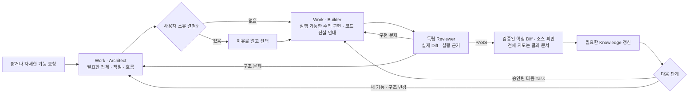
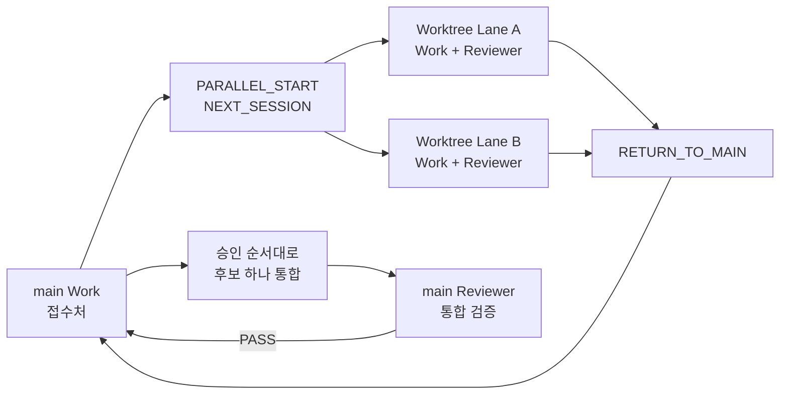

# AI Dev Workflow

[](https://github.com/yeomin-yoon/AI-Dev-Workflow/actions/workflows/validate.yml)
[](https://github.com/yeomin-yoon/AI-Dev-Workflow/actions/workflows/release-evidence.yml)
[](LICENSE)

*A human-centered, file-backed AI development workflow for low-friction starts, informed decisions, small verified changes, and independent review.*

**필요한 전체를 먼저 잡고, 실제 코드를 따라 작게 구현하며, 근거로 검증합니다.**

완벽한 프롬프트를 준비한 뒤 시작할 필요가 없다. “이 기능 구현해줘”처럼 짧게 출발해도 되고, 문제를 느끼지만 원인이나 표현이 아직 정리되지 않은 상태도 유효한 시작점이다. 알고 있는 목표·이유·환경·제약·완료 조건은 원하는 만큼 자세히 더할 수 있다.

<!-- tacit-seed-diagnostic: evidence-before-clarification -->
Work는 제공된 의도를 보존하고 프로젝트 파일에서 확인 가능한 맥락을 채운다. 막연한 감각을 곧바로 되묻거나 임의로 좁히지 않고, 관련 결과를 살펴 관찰된 상태·가능한 원인·가장 유력한 해석·작은 확인 방법으로 번역한다. 결과나 구조를 바꾸는 핵심 불확실성만 질문하고, 중요한 선택은 근거·영향·추천·재검토 조건을 보여준 뒤 사용자가 결정한다.

승인된 일은 작은 Task로 구현하고 별도 Reviewer가 실제 Diff와 실행 근거로 검증한다. 파일과 Git은 이 흐름을 세션과 AI 도구가 바뀌어도 이어 준다. AI로 빠르게 만들면서도 결과를 이해하고 다음 선택을 직접 판단하려는 개발자를 위한 Workflow다.

<!-- philosophy-core: human-judgment-over-automation -->
> AI는 사용자의 사고를 대신하지 않는다. 시작 부담과 반복 작업을 줄이고, 중요한 판단에 필요한 근거를 보여준다.

| 사용자가 겪는 문제 | AI Dev Workflow가 만드는 경험 |
|---|---|
| 시작 전에 요구사항을 완벽하게 정리해야 한다는 부담 | 짧거나 자세한 요청을 그대로 받고, 프로젝트에서 확인 가능한 맥락은 AI가 채운다. |
| 문제는 느끼지만 원인이나 전문 용어를 모름 | 관련 결과를 살펴 가능한 원인과 유력한 해석, 가장 작은 확인 방법을 제시한다. |
| AI가 추천한 구조를 이유도 모른 채 선택함 | 중요한 선택 전에 근거·영향·추천·재검토 조건을 이해할 수 있게 보여준다. |
| 처음부터 세부사항을 늘려 전체 구조가 안 보이거나, 반대로 설계 없이 코딩부터 시작함 | 지금 결정이 필요한 가장 낮은 설계 높이에서 책임·흐름·불변조건·끝 조건을 닫고, 실제로 실행되는 가장 얇은 전체 경로부터 구현한다. |
| AI가 아는 척하거나 익숙한 방법을 바로 복사해 판단 근거가 약함 | 프로젝트 근거를 먼저 보고, 필요할 때 원작/표준/공식 문서/전문 원리/검증된 구현을 AI가 조사해 적용할 원리와 맞지 않는 부분을 구분한다. |
| 작업 상태가 채팅에만 남아 세션 교체 시 유실 | 파일과 Git에서 승인된 상태·결정·근거를 복원한다. |
| 큰 기능을 한 번에 수정해 실패 범위가 불명확 | 독립적으로 구현·검증 가능한 Task 단위로 반복한다. |
| 작성 세션이 자신의 결과를 그대로 완료 처리 | 별도 Reviewer가 실제 변경과 실행 근거를 검증한다. |

## 사용법

### 빠른 시작

> [!NOTE]
> 대상 프로젝트에는 MIT 고지를 포함한 **`.ai` 폴더만** 복사한다. 저장소 루트의 `.git`, `.github`, `tools`, `evals`, `maintenance`는 배포 저장소의 검증·감사·릴리스 관리용이며 설치물이 아니다.

<!-- install-boundary: fresh-copy-vs-managed-update-vs-unrelated-ai -->
> [!WARNING]
> 대상 프로젝트에 `.ai`가 **없을 때만** 새로 복사한다. `.ai/maintenance/release.yaml`이 있으면 기존 AI Dev Workflow 설치본이므로 덮어쓰지 말고 [업데이트 절차](#workflow-개선과-업데이트)의 Check → Apply를 사용한다. 다른 도구가 만든 `.ai`라면 자동으로 합치지 말고 용도와 경로 충돌을 먼저 확인한다.

1. 대상 프로젝트에 `.ai`가 없다면 이 저장소의 `.ai` 폴더를 프로젝트 루트에 복사한다.
2. AI 도구로 프로젝트 루트를 열고 **[창 1] Work** 세션에 아래 Prompt를 붙인다.
3. `READY`를 확인한 뒤 **[창 2] Reviewer** 세션을 새로 열어 Reviewer Prompt를 붙인다.
4. 두 세션이 준비되면 Work에 만들 기능을 원하는 만큼 설명한다. `이 기능 구현해줘.`처럼 한 줄로 시작해도 된다.

> [!IMPORTANT]
> 아래 Bootstrap Prompt는 각각 **새 세션의 첫 번째 사용자 메시지**로 수정 없이 보낸다. System Prompt·Custom Instructions·터미널 명령으로 넣지 않는다.
> 두 Prompt를 같은 대화창에 입력하거나 기존 세션의 역할을 바꿔 재사용하지 않는다.

**[창 1] Work — 먼저 만들고 초기화가 끝날 때까지 기다린다.** 이 세션은 파일 상태에 따라 Knowledge Maintainer → Architect → Builder 역할만 전환하며 Reviewer 역할은 하지 않는다.

```text
Read `.ai/BOOTSTRAP.md`. role=work, lane=main, session_mode=compact, user_language=ko. If lane `main` is missing, create it from `.ai/lanes/_template`. Initialize only if needed, restore durable state, and reply READY or BLOCKED.
```

**[창 2] Reviewer — Work 초기화가 끝나면 별도 세션으로 만든다.**

```text
Read `.ai/BOOTSTRAP.md`. role=reviewer, lane=main, session_mode=compact, user_language=ko. Restore durable state from files and reply READY or BLOCKED.
```

현재 차례가 아닌 세션도 `READY ... next=wait_for_...`로 대기하는 것이 정상이다. 아직 Task나 Build Result가 없다는 이유만으로 `BLOCKED`가 되지는 않는다.

### 기본 개발 흐름



<details>
<summary>기본 사용 예시</summary>

```text
[창 1 · Work]
사용자: 로그인 기능 추가해야 해.
Work: 프로젝트 근거와 영향, 선택지, 추천안을 보여주고 중요한 구조 선택만 승인 요청
사용자: 추천안 승인해.
Work: 승인된 구조에서 실제로 실행되는 가장 얇은 전체 경로를 첫 Task로 만들고 구현. 첫 핵심 변경부터 현재 코드 위치·역할·흐름을 연결해 보여주며 계속 진행
Work: RESULT=ready_to_review ... DO_NEXT session=reviewer say="현재 Build Result를 검증해."

[창 2 · Reviewer]
사용자: 현재 Build Result를 검증해.
Reviewer: 실제 변경과 실행 근거를 독립 검증한 뒤 PASS 또는 수정 경로 제공. PASS면 Builder가 누적한 전체 소스 지도를 정확한 Diff와 대조하고, CODE_WALKTHROUGH에는 결과를 이해하는 데 필요한 가장 작은 연결된 소스 경로와 전체 지도 위치를 보여준다. 기본 설정에서는 Work용 DO_NEXT도 함께 제공
사용자: 실제 Diff와 안내된 핵심 소스파일을 연다. 궁금하면 Reviewer에 `R2 파일을 더 설명해줘` 또는 정확한 `경로#심볼`을 말하고, 전체 변경 파일은 Build Result의 Source Map에서 확인한다. 계속할 때는 표시된 DO_NEXT를 Work에 전달한다. 코드 확인 대기를 직접 켠 프로젝트만 `핵심 검토 소스를 확인했어. 계속해.`라고 답한 뒤 DO_NEXT를 받는다.
<!-- code-walkthrough-default: no-pause-do-next-visible -->

[창 1 · Work]
사용자: Reviewer의 DO_NEXT 문장을 그대로 붙여넣기
Work: PASS한 범위만 로컬 커밋하고, 승인된 Architecture의 다음 일반 Task 1개가 있으면 구현한 뒤 Reviewer 전달 직전에 정지
```

구조 선택이 없으면 Work는 승인 질문을 생략한다. 사용자는 내부 상태나 카드를 직접 작성하지 않고 생성된 `DO_NEXT`만 해당 창에 전달한다.

</details>

<details>
<summary>설치 조건과 초기화 확인</summary>

| 도구 능력 | 필요도 | 없을 때의 영향 |
|---|---|---|
| 프로젝트 루트의 파일 읽기·쓰기 | 필수 | 상태 복원과 결과물 저장을 할 수 없다. |
| 같은 프로젝트 폴더를 여는 별도 Work·Reviewer 세션 | 기본 구성에 필수 | 독립 Review가 불가능해져 검증 신뢰도가 낮아진다. |
| 빌드·테스트 등 터미널 명령 실행 | 강력 권장 | 사용자가 직접 실행해 근거를 전달해야 한다. |
| 프로젝트 자체 Git 저장소 | 강력 권장 | Worktree·후보 봉인·정확한 통합 검증을 사용할 수 없다. |

가능하면 최초 실행 전에 대상 프로젝트에 Git 기준 커밋 하나를 만든다. Git이 없어도 기본 사용은 가능하지만 Review 근거가 약해지고 Worktree·후보 봉인·통합 기능은 사용할 수 없다. PowerShell은 이 배포 저장소 자체를 검증할 때만 필요하다.

최초 초기화가 성공하면 응답은 대략 다음 형태이며 `initialization=complete`가 포함된다.

```text
READY role=work lane=main task=none phase=synced status=idle next=<다음 행동>
inputs=<최소 입력 경로>
initialization=complete updated=<갱신한 경로>
```

이때 `.ai/lanes/<lane>/lane.yaml`과 `.ai/lanes/<lane>/state.yaml`이 생성되어 있어야 하며, 최초 설치의 `<lane>`은 `main`이다. `BLOCKED`이거나 두 파일이 없다면 Reviewer를 만들기 전에 같은 Work 세션에서 누락 원인과 복구 방법을 요청한다. 이미 초기화된 프로젝트를 다시 열 때는 `initialization=complete`가 나오지 않아도 정상이다.

</details>

엄격한 역할 분리나 워크플로우 평가가 목적이면 아래 네 세션을 대신 사용할 수 있다. 같은 프로젝트 폴더에서 공용 Knowledge를 동시에 갱신하는 세션을 두 개 만들지는 않는다. 단, Worktree 모드를 시작하면 접수와 통합은 항상 별도의 `main` Work 세션이 담당한다.

<details>
<summary>엄격한 4세션 Prompt</summary>

최초 설치에서는 Knowledge Maintainer 세션만 먼저 만들고 `initialization=complete`가 포함된 `READY`를 확인한다. 이후 Architect·Builder·Reviewer 세션은 어느 순서로 만들어도 된다.

Knowledge Maintainer:

```text
Read `.ai/BOOTSTRAP.md`. role=knowledge_maintainer, lane=main, session_mode=strict, user_language=ko. If lane `main` is missing, create it from `.ai/lanes/_template`. Then, if it is uninitialized, complete BUILD; otherwise restore durable state without a broad scan. Preserve existing work and report the result.
```

Architect:

```text
Read `.ai/BOOTSTRAP.md`. role=architect, lane=main, session_mode=strict, user_language=ko. Restore durable state from files and reply READY or BLOCKED.
```

Builder:

```text
Read `.ai/BOOTSTRAP.md`. role=builder, lane=main, session_mode=strict, user_language=ko. Restore durable state from files and reply READY or BLOCKED.
```

Reviewer:

```text
Read `.ai/BOOTSTRAP.md`. role=reviewer, lane=main, session_mode=strict, user_language=ko. Restore durable state from files and reply READY or BLOCKED.
```

</details>

### 처음 보는 용어

| 용어 | 뜻 |
|---|---|
| Lane | 작업 소유 범위·상태·산출물을 분리하는 논리적 작업 흐름이다. 평소에는 `main` 하나만 사용하며, 병렬 개발 시 별도 Worktree·Branch와 연결될 수 있다. |
| Task | AI가 한 번에 구현·검증할 수 있게 나눈 작은 작업 단위다. |
| Build Result | Builder가 남기는 변경 경로·검증·위험 근거다. 코드 자체를 대신하지 않는다. |
| Change Brief | Reviewer가 PASS한 변경의 목적·핵심 흐름·지켜야 할 조건·확인 위치를 짧게 설명한 안내다. |
| Code Walkthrough | 검토된 실제 Diff와 변경된 소스파일을 어떤 순서로 왜 읽어야 하는지 보여주는 코드 확인 안내다. |
| Knowledge | 채팅 기억이 아니라 파일에 저장된 프로젝트 사실·위치·출처 색인이다. |
| Integration | 검토·봉인된 비-`main` 후보를 `main`에 반영하고 다시 검증하는 절차다. |

### 자주 쓰는 복붙 문장

정해진 명령어는 없다. 아래 문장은 자주 쓰는 예시일 뿐이며, 같은 뜻의 자연어로 말해도 된다.

#### 개발

| 하고 싶은 일 | 입력할 세션 | 입력 |
|---|---|---|
| 기능 시작 | Work | `<기능명> 구현해줘.` |
| Architecture 승인 | 질문한 Work/Architect | `이 Architecture를 승인해.` |
| 구현 결과 검증 | Reviewer | `현재 Build Result를 검증해.` |
| 현재 상태·중요 Diff·커밋 시점 확인 | Work | `현재 개발 상태와 이번 Task 변경, 커밋 가능 여부를 보여줘.` |
| 실제 Diff·소스파일 직접 읽기 | PASS를 낸 Reviewer | `이번 Task의 실제 Diff와 변경된 소스파일을 직접 볼 수 있게 파일 역할과 읽는 순서를 보여줘.` |
| Task마다 코드 확인 후 계속 | Work | `앞으로 Review PASS마다 실제 Diff와 소스파일을 확인한 뒤 다음 Task로 넘어가게 해줘.` |
| 코드 안내 후 자동 진행 | Work | `앞으로 코드 읽기 안내는 보여주되 다음 Task 전에 멈추지는 마.` |
| 자동 커밋 전에 확인받기 | Work | `앞으로 Review PASS 후 커밋 전에 확인해줘.` |
| 자동 커밋 후 다음 Task 전에 멈추기 | Work | `앞으로 Review PASS 후 로컬 커밋만 하고 다음 Task 전에 멈춰.` |
| 기본 자동 처리로 복귀 | Work | `앞으로 Review PASS 후 로컬 커밋하고 승인된 다음 Task 1개까지 진행해줘.` |
| Review 결과 처리 | `DO_NEXT`가 지정한 세션 | Reviewer가 생성한 `DO_NEXT` 문장을 그대로 붙여넣기 |

#### Knowledge·병렬 작업·세션

| 하고 싶은 일 | 입력할 세션 | 입력 |
|---|---|---|
| 프로젝트 변경 반영 | Work/Knowledge Maintainer | `변경사항 반영해줘: <추가한 문서·직접 수정한 코드·Git Pull/Merge>` |
| Worktree 병렬 작업 설계 | main Work/Architect | `캐릭터와 UI를 별도 Worktree에서 병렬 개발할 거야. 작업 경계를 설계하고 Lane별 시작 카드까지 만들어줘.` |
| 병렬 기준 커밋 완료 알림 | 위 요청을 시작한 세션 | `병렬 기준 커밋했어.` |
| 비-`main` 세션 종료·복귀 | 종료할 세션 | `마무리하고 main으로 복귀해.` |
| 불편 기록 후 복귀 | 종료할 세션 | `방금 불편도 Workflow 개선 후보로 기록하고 main으로 복귀해.` |
| 상태·라우팅 복구 | 현재 담당 세션 | `Read .ai/reference/OPERATIONS.md and handle this issue: <현재 문제>` |
| 수동 확인 안내 보완 | 요청한 Reviewer | `내가 정확히 무엇을 어떻게 확인해야 해?` |

`DEV_STATUS`, `CODE_WALKTHROUGH`, `COMMIT_READY`, `DO_NEXT`, `PARALLEL_START`, `NEXT_SESSION`, `RESUME_SAME_LANE`, `RETURN_TO_MAIN`, `FRONT_DESK_RECOVERY`, `USER_ACTION`은 AI가 현재 파일·Git에서 만들어 주는 카드다. 사용자가 직접 조립하지 않는다. Builder의 개발 중 코드 위치 안내는 별도 카드나 확인 Gate가 아니라 현재 Build Result Source Map의 작은 채팅 투영이다. `DO_NEXT`는 승인이 아니라 별도 세션으로 작업을 옮기는 전달 문장이다. 도구가 역할·Lane·후보 identity와 Reviewer 독립성을 보존해 세션을 연결할 수 있으면 자동 전달할 수 있고, 그렇지 않은 CLI·채팅에서는 표시된 한 줄만 복사한다. `PREPARE_DELTA`와 `INTEGRATE`도 내부 절차이므로 표시된 다음 문장만 따르면 된다.

기본 반복은 `Work에서 기능 요청 → 필요할 때 Architecture 승인 → Builder가 구현하며 핵심 코드 위치 안내 → Reviewer 검증 → PASS면 정확한 최종 Diff·핵심 소스 확인 → scoped 커밋 → Work에서 계속 진행`이다.

<details>
<summary><strong>상황별 상세 사용법</strong> — Worktree·통합·종료·복구·업데이트</summary>

### 평소 개발

빠른 표의 `기능 시작 → 구현 결과 검증 → 결과별 다음 입력` 순서로 사용한다. 세부 규칙은 다음과 같다.

- **Architecture:** 중요한 구조 선택이 있을 때만 Work가 프로젝트 근거와 한국어 Decision Brief를 보여준다. 먼저 지금 결정이 필요한 가장 낮은 높이(프로젝트·시스템·기능·컴포넌트/상호작용·Task)를 고른다. 그 경계 안에서 `목적/하지 않을 것 → 책임과 상태 주인 → 입력·출력과 핵심 흐름 → 불변조건·실패·끝 → 검증 → 지금 미룰 세부사항`이 서로 모순 없이 이어지고, 실제 입구부터 눈에 보이는 결과까지 관통하는 가장 얇은 실행 경로가 정해지면 설계를 멈춘다. 작은 변경 때문에 프로젝트 전체를 다시 설계하지 않고, 넓은 설계 때문에 튜닝값·함수 내부까지 미리 확정하지도 않는다. 첫 Task는 빈 인터페이스나 폴더 뼈대가 아니라 그 실행 경로를 통과하는 수직 기능이다. 짧은 동의는 표시된 사용자 소유 결정에만 적용되고, 승인 범위 안의 일반 Task는 내부 Architect가 JIT으로 만든다. <!-- collaborative-design-altitude: bounded-pass-needed-now -->
- **레퍼런스와 AI의 공부:** 프로젝트의 승인 의도와 실제 코드를 먼저 본다. 그래도 중요한 판단 근거가 부족하면 AI가 원작/호환 대상의 실제 동작, 프로젝트 선례, 공식 표준·문서, 검증된 구현, 컴퓨터공학·소프트웨어공학·도메인 원리와 필요한 작은 실험까지 역할을 구분해 조사한다. 사용자가 특정 원작 동작을 기준으로 승인한 범위는 구현 예시가 아니라 의도 기준으로 다루고, 그 밖의 부분까지 자동 복사하지 않는다. 결과는 연구 목록이 아니라 `어떤 원리를 얻었는지 → 현재 프로젝트와 무엇이 같고 다른지 → 무엇을 적용/비적용했는지 → 어느 Architecture·코드에서 확인하는지 → 언제 다시 볼지`로 압축한다. 기계적이거나 이미 결정된 일에는 조사 의례를 만들지 않고, 사용자를 먼저 공부시킨 뒤 결정하게 하지 않는다.
- **문서가 변하는 방식:** 사용자·팀 기획 문서는 기본적으로 참조만 하고, 명시적으로 맡긴 문서 작업이 아니면 AI가 고치지 않는다. Architecture·state·Knowledge는 현재 승인 구조·진행 위치·검색 정보를 나타내는 최신 문서이고 Git이 변화 이력을 남긴다. 승인·종료된 Task와 Build·Review는 당시 변경의 증거라서 나중에 덮어쓰지 않고 후속 Task/시도로 이어간다. 실제 구현은 언제나 현재 소스·설정·에셋에서 확인하며, 구현 중 발견은 그 사실의 원래 소유 문서에만 되돌려 반영한다.
- **선택 화면:** 실제로 결과가 달라지는 선택만 묻는다. 가능한 결과가 2~3개면 첫 화면에 **추천과 가능한 대안 전부**를 함께 보여주고, 각각 `무엇이 달라지는지·실제 대가`를 짧게 적는다. 4개 이상이면 아무 대안도 숨기지 않고 먼저 최대 3개의 상호 배타적·전체 포괄 범주로 판별 질문을 한 뒤, 선택한 범주의 모든 대안을 다음 화면에 보여준다. 긴 파일·테스트·내부 ID 목록은 근거 링크나 scoped Diff로 뒤에 두며, `1/A` 같은 답은 이미 표시된 의미 있는 선택의 단축 입력일 뿐이다. 이해한 하나의 선택에 짧게 동의하는 것은 유효하지만, `모르겠으니 알아서 해`처럼 혼란이나 포기를 드러낸 답은 사용자 소유 결과의 승인이 아니다. 그때 AI는 되돌릴 수 있는 내부 선택은 직접 설명하고 결정하며, 지금 필요 없는 선택은 미루고, 꼭 필요한 제품 선택만 더 쉽게 다시 보여준다. 필수 상태 재고정이나 안전한 내부 정리는 선택지로 만들지 않고 처리 후 보고하며, `커밋 + 다음 Task`처럼 서로 다른 행동도 한 선택에 묶지 않는다. <!-- readable-choice: recommendation-and-alternatives-together; checkpoint-repin: mandatory-not-choice; informed-assent: concise-not-surrender -->
- **불완전한 기획:** AI는 먼저 `현재 실제 동작 → 기획서의 정확한 의도 → 둘 사이의 빠진 부분`을 쉬운 말로 보여준다. 기획에 명시된 행동은 그대로 지키고, 클래스·함수·내부 책임처럼 사용자 체감이 없는 빈칸은 프로젝트 근거로 되돌리기 쉽게 결정해 설명한다. 반대로 기획에 없는 플레이·제품 동작은 마음대로 만들지 않고 그 부분만 사용자에게 묻는다. 이미 실행 근거로 실패한 기술 방향은 다시 정상 선택지로 올리지 않는다. <!-- intent-gap-brief: current-intent-gap-ai-user; planning-gap-classification: specified-implementation-product-authority -->
- **진단과 진행:** 이상 동작을 조사할 때는 현재 Task의 합격 기준과 승인된 기획 의도를 먼저 확인한다. AI는 `직접 관찰 / 아직 가설 / 확인 완료`를 구분하고, 다른 원인을 가르는 확인이 끝나기 전에는 원인을 확정했다고 말하지 않는다. 현재 합격을 직접 깨는 문제만 작업을 멈추며, 관련 있지만 비차단인 발견이나 추측은 새 Task·선택·검토 연쇄로 만들지 않는다. 사용자 확인이 필요하면 첫 줄에 **지금 할 일 하나와 저장 여부**를 적고, 같은 화면에서 볼 수 있는 확인은 한 번에 묶는다. 상태·노드·전이처럼 처음 쓰는 화면 용어가 단계에 들어가면 보이는 이름과 현재 작업에서의 역할을 먼저 설명하고, 전체 동작 흐름과 완료된 화면 모양을 단계 전에 보여준다. `지난번과 같다`는 말로 절차를 생략하거나 보지 못한 주변 설정까지 안전하다고 단정하지 않는다. 기획이 이미 정한 결과를 다시 선택지로 묻거나, 확인되지 않은 가설을 Architecture·Task·Knowledge의 사실로 기록하지 않는다. <!-- diagnostic-discipline: intent-evidence-one-action-delivery-focus; manual-authoring-guide: whole-flow-first-use-terms-finished-shape -->
- **설명·전문지식·가독성:** 매번 먼저 `무슨 결과인지 → 왜 중요한지 → 누가 어떤 흐름을 소유하는지 → 현재 실제 코드 위치 → 무엇이 증명됐고 남았는지 → 다음 행동`을 찾기 쉽게 보여준다. 몇 초·몇 줄·몇 파일 같은 고정 제한으로 자르지 않으며, 같은 내용을 Verdict·Change Brief·전문가 메모·Walkthrough에 반복하지 않는다. 전문 원리는 현재 변경을 유지하거나 비슷한 실수를 피하는 데 도움이 될 때 이 흐름 안에 연결하고, 쉬운 의미·정확한 용어·코드 위치·재사용 기준 순으로 설명한다. 사용자가 이미 이해한 말은 반복하지 않지만 실제 코드·흐름·근거는 숙련도를 추측해 생략하지 않는다. AI 지원을 줄이거나 수업·퀴즈·승인 Gate를 추가하지 않는다. <!-- bounded-expert-note: core-first-one-by-default -->
- **여러 기술 문제 정리:** AI가 개발 중 여러 정리거리를 발견하면 막연히 `전부 처리할까요?`라고 묻지 않는다. 지금 결과를 막는 문제, 현재 작업 뒤에 정리할 문제, 선택적 개선을 나누고, AI가 안전하게 처리할 내부 정리와 실제 사용자 선택을 구분한다. 현재 기능과 직접 관계없는 문제는 진행을 빼앗지 않으며, 상태·Knowledge 재고정 같은 결정적 마무리는 선택지로 떠넘기지 않는다.
- **구현 중 코드 안내:** Architect가 근거로 확인한 기존 책임·흐름과 예상 위치는 Builder가 실제 구현 진입점을 찾는 즉시 정확한 `경로#심볼`로 교체한다. Builder는 늦어도 첫 비자명한 production-source 변경에서 입구부터 결정/상태와 결과까지 이어지는 가장 작은 코드 경로를 쉬운 역할 설명과 함께 보여주고 계속 작업한다. 이후에는 새 클래스·책임·의존 방향·런타임 경계가 생기거나 위치가 바뀔 때만 달라진 부분을 안내한다. 누적 전체 목록은 같은 Build Result의 `Changes`와 `Source Map`이 한 번만 소유한다.
- **Review:** `RESULT=ready_to_review`이면 Reviewer에서 검증한다. 일반 Task의 `pass`는 Builder의 전체 소스 지도를 실제 reviewed Diff와 독립 대조하고, `CODE_WALKTHROUGH` 채팅에는 결과를 설명하는 가장 작은 연결된 코드 경로와 전체 지도 위치를 보여준다. 고정 파일 개수보다 입구·책임/결정·결과가 끊기지 않는지가 기준이다. 새 설치와 설정 없는 기존 설치는 기본적으로 Walkthrough를 보여준 뒤 멈추지 않는 `no_pause`이며, 위의 `Task마다 코드 확인 후 계속` 문장으로 프로젝트가 명시적으로 opt-in한 경우에만 identity를 재검증할 수 있는 비자명한 production-source Review에서 답변을 기다린다. Git 없는 `no-git/unsealed` Review는 opt-in 상태여도 동일성 재검증이 불가능하므로 설명만 보여주고 멈추지 않는다. 핵심 읽기 단계는 `R1`처럼, 전체 지도 항목은 정확한 `경로#심볼`로 질문한다. 기계적·비코드 변경은 확인 대기를 만들지 않으며, main에 적용된 범위를 다시 확인하는 Integration Review도 별도의 코드 확인 대기를 만들지 않는다. `implementation`은 Work/Builder가 자동 수정하고, 구조·외부 공개 계약 변경은 Work/Architect로 보내지만 산출물(artifact) 형식·상태 계약 문제는 해당 산출물의 작성 역할로 보낸다. 사용자는 분류를 다시 해석하지 말고 Reviewer가 생성한 안내를 따른다. `BLOCKED owner=user`이면 같은 Reviewer가 `EDITOR_CHECK`로 열 위치·준비·조작·관찰 위치·PASS/FAIL·복붙 답변을 안내한다.
<!-- planned-editor-authoring: builder-before-review -->
- **에디터 작업·검증:** Task에서 미리 아는 에디터 자산·설정 저장은 구현의 일부이므로 Builder 단계에서 한 번에 안내·반영한 뒤 최종 검증하고 Reviewer에게 넘긴다. 보기만 하는 검증은 후보가 그대로일 때 같은 Review가 이어진다. Review가 시작된 뒤 새로 발견된 저장 작업은 후보를 바꾸므로, 동작이 정상이어도 Builder가 변경 경로와 fingerprint를 새 Build Result로 다시 묶은 뒤 Reviewer가 새 후보를 검증한다. Task 범위 밖이나 출처 불명 파일은 자동으로 포함하지 않는다.
- **Git 체크포인트:** Git을 쓰는 기본 main 작업에서는 독립 Review PASS가 정확히 검토된 범위의 로컬 체크포인트 시점이자 기본 권한이다. Work는 fingerprint·포함/제외 경로·Hook·서명·자격증명을 다시 확인하고 안전할 때만 검토된 내용 커밋을 만든다. 그 revision을 state/Knowledge에 다시 적어야 하면 해당 메타데이터만 자동 재고정해 별도 closure 커밋으로 남기고 두 revision을 함께 보고한다. 이것은 필수 내부 마무리이지 다시 고를 항목이 아니다. 코드 확인 대기와 체크포인트가 끝나면 새 설치는 승인된 Architecture의 다음 일반 Task 하나까지 진행한다. 코드 확인 정지·커밋 전 확인·커밋 뒤 정지는 위 문장으로 프로젝트 설정을 바꿀 수 있다. 어느 설정도 Push·태그·새 Architecture·외부 작업·다음 내용 커밋을 승인하지 않는다.
- **설명과 갱신:** Architecture의 의도·책임·흐름은 Builder의 실제 `경로#심볼`과 Reviewer의 검증된 Diff까지 같은 말로 이어진다. 전체 변경 파일 역할은 Build Result 한 곳에 남고, 채팅은 그 결과를 이해하는 연결된 코드 경로와 테스트가 증명하지 못하는 범위에 집중한다. Work는 필요한 Knowledge 갱신을 수행하거나 작은 변경을 다음 체크포인트까지 묶는다.
- **기능 마무리:** 마지막 Task가 PASS했다고 전체 기능이 자동으로 끝난 것은 아니다. 더 할 Task가 없다고 보이는 경계에서 Architect가 현재 승인 범위와 기능 조각을 완료된 Task·Review·실제 코드·검증에 한 번 대조한다. 이미 기획된 누락은 묻지 않고 다음 작은 Task로 만들며, 사용자 동작이나 구조가 새로 결정돼야 할 때만 기존 Gate로 돌아간다. 모두 구현됐거나 승인 범위에서 제외된 경우에만 완료라고 말하고, 의도적으로 미룬 항목이 있으면 Lane이 쉬더라도 `완료`가 아니라 `보류 중`이라고 알려준다. 별도 Spec 문서·점수·승인 단계는 만들지 않는다.
- **인계:** 다른 세션이 필요하면 `DO_NEXT session=... say="..."`가 생성된다. 병렬 작업에서는 `lane`과 `worktree`도 표시된다. 내부 `route`를 해석하지 말고 안내된 문장만 지정된 세션에 붙여넣는다.

### Knowledge 바로 사용

기본 2세션 구성에서는 Work에, 엄격한 4세션 구성에서는 Knowledge Maintainer에 짧게 말하면 된다.

파일을 추가하는 것만으로 자동 실행되지는 않으므로 `변경사항 반영해줘:` 뒤에 추가한 문서, 직접 수정한 코드, Git Pull/Merge 중 실제 변경만 짧게 알려준다. 새 세션이나 Bootstrap 재입력은 필요 없다. 프로젝트의 위치나 사실은 `무기 시스템 진입점이 어디야? 근거 경로만 알려줘.`처럼 일반 질문으로 물으면 된다.

### Worktree 병렬 시작

Worktree는 같은 Git 저장소의 다른 Branch를 별도 폴더에서 동시에 여는 기능이다. 평소에는 `main` Lane만 사용한다. 서로 겹치지 않는 기능을 실제로 동시에 개발할 때만 경계 설계를 요청하며, 기본 구성에서는 기존 `main` Work에, 엄격한 4세션 구성에서는 `main` Architect에 말한다.

Worktree 모드에서 `main` Work는 항상 **접수처(Front Desk)**다. 새 작업을 받아 Lane별 시작 카드를 발급하고, Worktree에서 돌아온 상태를 인수해 통합하거나 다음 세션 카드를 발급한다. 접수처는 상주 채팅이 아니라 필요할 때 파일·Git에서 복원하는 절차다. 교체하거나 사용량이 끝나면 이전 채팅 없이도 같은 main 폴더에서 새 세션을 열어 아래 두 문장을 순서대로 입력한다. 엄격한 구성으로 경계를 설계했더라도 실제 Lane 구현과 리뷰는 각 Worktree 세션에서 수행한다.

```text
Read .ai/BOOTSTRAP.md. role=work, lane=main, session_mode=compact, user_language=ko
Read .ai/contracts/MAIN_DESK.md#front-desk-recovery and restore Front Desk from files/Git. Inspect main status, Integration queue, active item/repair, pending Reviews/Knowledge, and report the next bounded action without integrating on ambiguity.
```



> [!WARNING]
> 세션은 Bootstrap 뒤 하나의 Worktree·Lane에 고정된다. `NEXT_SESSION`을 받으면 표시된 대상 폴더를 열어 **새 세션**을 만들고 Prompt를 붙인다. 기존 세션에 다른 Lane Prompt를 넣어 재사용하지 않는다.

```text
캐릭터와 UI를 별도 Worktree에서 병렬 개발할 거야.
작업 경계를 설계하고 Lane별 시작 카드까지 만들어줘.
```

경계를 승인하고 안내된 기준 파일을 Git에 커밋한 뒤 요청을 시작한 같은 세션에 `병렬 기준 커밋했어.`라고 답한다. 기본적으로 각 Lane은 토큰과 세션 부담이 적은 Work+Reviewer 2세션으로 구성된다. 처음에는 main 접수처 Prompt와 Worktree 생성 명령까지 포함한 `PARALLEL_START`, 이후에는 필요한 새 세션만 담은 `NEXT_SESSION`이 나오므로 순서대로 복붙하며 `lane=main`을 직접 수정하지 않는다.

각 Lane은 기본적으로 안내된 Worktree 폴더의 새 Work·Reviewer 세션으로 운영한다. 별도 Lane도 엄격한 4세션으로 운영하려면 최초 요청 끝에 `각 Lane도 엄격한 4세션으로 만들어줘.`를 붙인다.

### 병렬 작업 통합

`integration_order`는 병렬 경계를 승인할 때 의존성을 고려해 함께 정한 안전한 통합 순서다. 예를 들어 `character → ui`라면 Character의 계약을 먼저 `main`에 넣고 검증한 뒤 UI를 넣는다. 이미 승인한 순서이므로 충돌·공유 계약 변경·범위 추가·새 증거가 없으면 다시 선택하지 않는다.

비-`main` Lane의 각 Task는 Builder가 해당 Task 변경만 담은 후보 커밋을 만든 뒤 Reviewer가 그 정확한 revision을 검토한다. PASS 후에는 현재 Lane의 Task·Build·Review·state만 담은 **Lane 인계 커밋**으로 후보를 봉인한다. 이는 승인된 Worktree 전달 절차라서 매번 묻지 않으며, 사용자 변경이나 다른 경로는 포함하지 않는다.

Lane의 마지막 세션을 마무리하면서 나온 `RETURN_TO_MAIN`의 `DO_NEXT` 한 줄을 **main Work 세션**에 붙여넣는다. main Work는 검토된 후보 커밋·트리와 Lane 인계 커밋이 일치하는지 확인한다.

봉인된 후보라면 승인 순서의 한 Lane만 반영하고, 병합 전후 revision을 기록한 뒤 main Reviewer로 보낼 정확한 `DO_NEXT`를 준다. 직접 실행할 수 없거나 커밋·권한·충돌 문제가 있으면 사용자가 해야 할 단계와 PASS 기준을 `USER_ACTION`으로 준다.

main Reviewer의 통합 검증이 PASS하면 Review와 통합 Queue 정보만 담은 체크포인트 커밋을 남긴다. 필요한 공용 Knowledge 갱신도 별도 Knowledge 체크포인트로 정리한 뒤 `DO_NEXT`에 따라 main Work로 돌아가 다음 Lane을 같은 방식으로 처리한다. 사용자는 통합 순서를 외우거나 매번 승인할 필요 없이 표시된 복붙 문장만 따르면 된다.

같은 Lane에서 다음 Task를 계속하더라도 통합 전의 기존 Worktree를 그대로 재사용하지 않는다. main 접수처가 현재 main 기준의 새 Branch·Worktree·세션 Prompt를 만들어 주며, 같은 Lane ID로 최신 코드와 Knowledge에서 이어간다. 더 할 일이 없으면 Lane은 `synced/idle`로 남고, Worktree 삭제나 Lane `retired` 처리는 별도 선택이다.

### 세션 종료와 교체

빠른 표의 `마무리하고 main으로 복귀해.`는 비-`main` 세션을 실제로 닫거나 교체할 때 사용하는 표준 명령이다. 현재 Architecture·Task·Build·Review 경로, 승인된 결정, 단계와 상태, 검증 결과, 열린 위험·차단 사유, 다음 역할·행동과 최소 입력 경로를 파일에 체크포인트한다.

세션은 오래됐다는 이유만으로 바꾸지 않는다. AI는 Review PASS·체크포인트 뒤나 새 Architecture·Task·Build·Review·Integration을 시작하기 전처럼 안전한 경계에서만, **다음 작업 하나와 그 상태 저장까지 끝낼 여유가 있는지** 조용히 판단한다. 도구가 남은 Context·사용량 경고를 보여주면 그 표시가 우선이며, 표시가 없으면 이미 파일에서 복원한 사실을 반복해서 잊거나 현재 역할·후보를 헷갈리는 등 반복되는 증거가 있어야 한다. 충분하면 묻지 않고 계속하고, 부족할 가능성이 높으면 다음 작업을 시작하기 전에 교체 문장을 먼저 준다. AI가 정확한 잔여 토큰을 추측하거나 단순한 턴 수만으로 교체를 강요하지 않는다.

전체 대화·숨은 추론은 저장하지 않는다. 종료 명령 자체도 새 Git 커밋·병합이나 아직 선택하지 않은 Knowledge 갱신을 실행하지 않는다. 후보·Lane 인계·Integration Review·Knowledge 체크포인트 커밋은 각각 그보다 앞선 소유 절차에서만 생성된다.

| 이동 상황 | 해야 할 일 |
|---|---|
| 같은 Worktree·같은 Lane에서 현재 세션 계속 사용 | 종료하지 않고 그대로 계속한다. |
| 같은 Lane의 이미 열린 Work↔Reviewer 이동 | 표시된 `DO_NEXT`를 해당 세션에 바로 붙인다. main을 거치지 않는다. |
| 같은 Lane·Worktree·역할을 그대로 유지한 새 세션 교체 | `마무리하고 같은 Lane의 새 세션으로 이어가.` → `RESUME_SAME_LANE`으로 바로 복원한다. |
| 비-main 후보 복귀·Lane 이탈·다른 Worktree 이동 | `마무리하고 main으로 복귀해.` → 나온 `DO_NEXT`를 main Work에 붙인다. |
| main 접수처 세션 자체 교체 | 위 고정 main Prompt와 복구 문장을 같은 main 폴더의 새 세션에 입력한다. 이전 채팅은 필요 없다. |

비-main 종료 결과에는 현재 Worktree·Lane·역할·세션 구성·Branch, 검토/봉인 revision, 변경 종류별 dirty 경로, Observation과 main 경로가 담긴 `RETURN_TO_MAIN`이 나온다.

main은 이 카드가 가리키는 파일과 Git을 직접 확인하고 다음 행동 하나를 선택한다. 새 세션이 필요하면 정확한 폴더·역할 Prompt·첫 요청까지 채운 `NEXT_SESSION`을 주므로 사용자는 과거 Prompt나 대화를 보관할 필요가 없다.

종료는 상태와 Git만 정리하고 Workflow 불편을 자동 기록하지 않는다. 불편을 바로 고치고 싶으면 **AI Dev Workflow 배포 저장소** 세션에서 `이 Workflow를 쓰면서 <불편>했어. 어떻게 생각해?`처럼 그냥 말하면 된다. 현재 프로젝트에 로컬 기록을 꼭 남겨야 할 때만 명시적으로 Observation 캡처를 요청한다.

결과의 `RETURN_TO_MAIN`에서 `observation=<path>`이면 사용자가 명시적으로 요청해 현재 Worktree에 남긴 기록이다. `none`은 로컬 기록이 없다는 뜻일 뿐 자동 판정을 실행했다는 뜻이 아니다. Observation만 남아 있는 `dirty` 상태는 봉인된 커밋의 병합을 막지는 않지만 Worktree 삭제는 막는다. AI Dev Workflow 배포 저장소로 자동 전송되지 않는다.

### 문제가 생겼을 때

정상 흐름에서는 사용하지 않는다. `BLOCKED`의 담당이 불명확하거나 상태 불일치·충돌·복구가 필요할 때만 사용한다.

```text
Read `.ai/reference/OPERATIONS.md` and handle this issue:
<현재 문제를 한 줄로 작성>
```

- `OUTCOME=resolved` → 정상 흐름으로 복귀
- `OUTCOME=routed` → 지정된 역할 세션으로 이동
- `OUTCOME=blocked owner=user` → 요청된 정보나 결정 제공

`owner=user`이면 왜 필요한지, 정확한 앱·경로·순서, PASS 기준, 복붙할 답변 형식과 대안이 함께 나와야 정상이다. 안내대로 확인한 뒤 그 요청을 만든 같은 세션에 결과를 답한다. `에디터/런타임 근거 제공`처럼 한 줄만 나오면 같은 세션에 `내가 정확히 무엇을 어떻게 확인해야 해?`라고 물어도 된다. Workflow는 사용자의 조치를 요구하기 전에 이 안내를 제공해야 한다.

### Workflow 개선과 업데이트

#### 유지보수용 복붙 문장

| 하고 싶은 일 | 입력할 곳 | 입력 |
|---|---|---|
| 불편사항 바로 검토 | 배포 저장소 세션 | `이 Workflow를 쓰면서 <불편>했어. 어떻게 생각해?` |
| 로컬 기록을 선택적으로 보존 | 현재 프로젝트 세션 | `방금 문제를 Workflow 개선 후보로 기록해줘.` |
| 여러 설치본 기록 취합 | 배포 저장소 세션 | `다음 설치본들의 Workflow 개선 기록만 이 배포 저장소에 취합해줘. sources: <경로들>` |
| 취합 기록 검토 | 배포 저장소 세션 | `취합된 Workflow 개선 기록을 검토하고 업데이트 후보를 정리해줘.` |
| Workflow 자체 검토 | 배포 저장소의 새 세션 | `Read maintenance/WORKFLOW_REVIEW.md and review the current Workflow. mode=changed user_language=ko` |
| 프로젝트 업데이트 확인 | 프로젝트 세션 | `Workflow 업데이트 확인해줘. source=<GitHub URL 또는 로컬 경로>` |
| 확인된 업데이트 적용 | 같은 프로젝트 세션 | `확인된 Workflow 업데이트 적용해줘.` |
| 배포용 `.ai` 갱신 | 배포 저장소의 새 세션 | `Read maintenance/RELEASE.md and run BUILD_RELEASE_COPY. sources: <경로들>` |
| 소스 커밋 후 릴리스 검토·Eval 확정 | 소스를 수정하지 않은 새 배포 저장소 세션 | `Read maintenance/RELEASE.md and run FINALIZE_RELEASE_EVAL for HEAD.` |

대부분은 배포 저장소에서 그냥 문제를 이야기하면 된다. 현재 프로젝트 작업을 마치기 전에 증거를 잃을 위험이 있을 때만 로컬 기록을 선택한다. 일반 역할은 세션 종료를 이유로 새 개선 작업을 만들지 않는다.

<!-- workflow-review-summary: canonical-lenses-1-through-10 -->
`Workflow 자체 검토`는 프로젝트 코드를 리뷰하는 Reviewer와 다르다. 배포 저장소에서 목적·첫 사용·단계·책임·실패 복구·검증·권위·Context·이식성·효율·유지보수·보안을 종합 점검하고, 마지막에 자신의 첫 판정도 한 번 역검증하는 읽기 전용 절차다. 누락·오탐·개수/결론 모순을 고칠 수 있지만 무한 재검토는 하지 않으며, 파일 수정이나 릴리스를 자동으로 수행하지 않는다. 기본 복붙문은 `changed`이고, 첫 기준선·대규모 재설계·정기 감사에만 `mode=full`로 바꾼다. 공개 릴리스에서는 소스를 작성하지 않은 새 `FINALIZE_RELEASE_EVAL` 세션이 깨끗한 커밋을 검토하고 자기검증 결과까지 release Eval에 함께 보존한다.

<details>
<summary>여러 프로젝트·Worktree의 개선 기록 취합</summary>

기록은 서로 자동 공유되지 않는다. 별도 **AI Dev Workflow 배포 저장소**를 열고 설치본 경로만 전달한다.

```text
다음 설치본들의 Workflow 개선 기록만 이 배포 저장소에 취합해줘.
sources:
- <프로젝트 또는 Worktree 경로>
- <프로젝트 또는 Worktree 경로>
```

`OBS-*.yaml`만 가져오며 재수집해도 중복 집계하지 않는다. 코드·Knowledge·Lane·Task·Eval과 Workflow Core는 변경하지 않는다. 취합 후 실제 개선 여부를 판단할 때만 말한다.

```text
취합된 Workflow 개선 기록을 검토하고 업데이트 후보를 정리해줘.
```

</details>

### GitHub용 `.ai` 복사본 갱신

개발 프로젝트의 `.ai`를 정리하거나 지우지 않는다. 상태가 모두 남아 있는 개발 프로젝트와, 프로젝트 내용이 없는 GitHub 배포용 복사본을 별도로 유지한다.

```text
개발 프로젝트/.ai       → Knowledge·Lane·Task·Review를 그대로 보존
AI-Dev-Workflow/.ai     → 공통 Workflow만 담은 별도 배포용 복사본
```

공통 개선을 배포용 복사본에 반영하려면 별도 **AI Dev Workflow 배포 저장소**를 새 AI 세션으로 열고 다음 한 번만 보낸다.

```text
Read `maintenance/RELEASE.md` and run BUILD_RELEASE_COPY.
sources:
- <개발 프로젝트 또는 Worktree 경로>
user_language=ko
```

이 명령은 지정한 개발 프로젝트를 읽기 전용으로 비교하고, Observation과 공통 Workflow 파일의 차이를 개선 후보로 사용한다. 개발 프로젝트의 파일은 삭제·정리·수정하지 않는다. 프로젝트 Knowledge·실제 Lane·Architecture·Task·Build·Review·Integration·업데이트 상태도 배포용 복사본에 넣지 않는다.

승인 가능한 공통 변경만 별도 `AI-Dev-Workflow/.ai`에 일반화해 반영하고 버전·Changelog·영향받는 Eval 항목의 사전 검사와 개발 중 검증까지 수행한다. 중요한 정책 충돌은 적용하지 않고 먼저 묻는다.

<!-- release-finalizer-session: fresh-non-authoring -->
`BUILD_RELEASE_COPY RESULT=source_commit_required`이면 변경 내용을 확인해 **소스 변경만 먼저 커밋**한다. 그다음 소스를 작성한 세션을 닫고, 소스 변경을 작성하지 않은 새 배포 저장소 세션을 연 뒤 아래 문장을 보낸다.

```text
Read `maintenance/RELEASE.md` and run FINALIZE_RELEASE_EVAL for HEAD.
```

이 단계는 방금 만든 소스 커밋의 revision/tree를 대상으로 Eval을 실행하고, 완료된 Eval 파일 하나만 stage한 뒤 릴리스 검증을 수행한다. `FINALIZE_RELEASE_EVAL RESULT=eval_commit_required`이면 staged Eval을 확인해 두 번째 커밋을 만들고 Push한다. `no_change`이면 올릴 새 공통 변경이 없고, `blocked` 또는 `failed`이면 함께 나온 원인을 먼저 해결한다.

<details>
<summary>무엇이 보존되고 무엇이 반영되는가</summary>

| 구분 | 처리 |
|---|---|
| 개발 프로젝트의 코드·문서 | 읽거나 복사하지 않음 |
| Project Knowledge·Architecture·실제 Lane·Task·Build·Review | 개발 프로젝트에 그대로 보존 |
| Observation과 공통 파일 Diff | 개선 여부를 판단하는 후보로만 사용 |
| `BOOTSTRAP`, `WORKFLOW`, 역할·계약·공통 템플릿 | 승인된 일반 개선만 배포용 복사본에 재적용 |
| 버전·Changelog | 첫 번째 소스 변경에 포함 |
| Eval | 첫 번째 소스 커밋의 revision/tree를 검증한 뒤 별도 기록·커밋 |
| 커밋·Push | 사용자가 두 단계의 Diff를 각각 확인한 뒤 수행 |

배포본을 다시 프로젝트에 적용할 때 `.ai/maintenance/UPDATE.md`의 절차를 따르고 업데이트 검증을 통과하면 관리 대상 공통 파일만 갱신되고 기존 Knowledge·Lane·작업 기록은 보존된다. 검증이 실패하면 보존을 가정하지 말고 백업을 유지한 채 중단한다.

</details>

각 개발 프로젝트에서는 위 유지보수용 표의 두 문장을 사용해 배포 출처 확인과 업데이트 적용을 나눠 실행한다.

업데이트 후에는 업데이트가 적용된 프로젝트 폴더를 사용하는 모든 기존 세션을 종료하고 같은 Lane·역할의 Bootstrap Prompt로 다시 만든다. 여기에는 모든 병렬 Lane과, 엄격한 구성이라면 네 역할 세션 전부가 포함된다.

</details>

<details>
<summary><strong>Workflow 구조와 원리</strong> — 역할·학습·Knowledge·Context·Lane·배포</summary>

### 설계 원칙

Workflow를 변경할 때 사용하는 철학의 단일 기준은 [Design Principles](.ai/WORKFLOW.md#design-principles)다. 아래는 사용자용 전체 요약이며, BOOTSTRAP과 역할 계약은 원칙을 실행하고 Eval은 실제 품질·비용 효과를 측정한다. 일반 사용 중에는 내부 문서를 따로 읽을 필요가 없다.

이 Workflow의 주인공은 파일이나 Git이 아니라 판단하는 사용자다. 파일·Task·Reviewer·Eval은 AI가 근거를 건너뛰거나 중요한 판단까지 대신하지 못하게 하는 보조 장치다.

<!-- public-philosophy-summary: canonical-design-principles-1-through-11 -->
<!-- public-philosophy-source-sha256: 260320cf9c3a545471cc7e0f3bb2103f8530d583119dd3c5dec92c59abe6b67e -->
1. **채팅 기억보다 파일과 Git.** 세션은 교체 가능한 작업자이고, 지속 상태·결정·근거·이력은 각 파일과 Git에 남긴다.
2. **필요한 최소 전체를 세우고 그 안에서 작게 구현.** 지금 결정이 들어 있는 가장 낮은 설계 높이에서 목적·책임·흐름·불변조건·끝·검증을 닫고, 실제 입구부터 결과까지 관통하는 가장 얇은 실행 경로를 먼저 만든 뒤 작은 수직 Task로 반복한다. 작은 변경은 프로젝트 전체를 다시 설계하지 않고, 넓은 설계도 되돌릴 수 있는 세부사항까지 미리 확정하지 않는다.
3. **입력 깊이는 사용자에 맞춘다.** 짧은 요청·상세 명세·참조 문서뿐 아니라 아직 전문적으로 정의되지 않은 문제 감각도 유효한 Seed로 보존한다. 넓은 협업 요청은 현재 설계 높이·이번 결과·미룰 깊이·멈출 지점부터 맞추고, 프로젝트에서 알 수 있는 맥락을 찾아 증상과 원인 후보를 먼저 번역한 뒤 지금 결과를 바꾸는 사용자 소유 불확실성만 질문한다.
4. **Context 양보다 품질.** 상태 포인터·경로·심볼·Diff부터 읽고, 근거가 부족할 때만 Context를 확장한다.
5. **자신감보다 증거.** 승인된 의도, 실제 소스, 결정적 검사, 런타임 관찰과 정확한 revision이 수용 여부를 결정한다. 검사 통과도 그 기준이 약해지지 않았을 때의 증거일 뿐, 설계와 장기 유지보수성을 자동으로 보증하지 않는다.
6. **자기 승인보다 독립 검증.** 결과를 만든 세션은 자신의 결과에 독립 PASS를 줄 수 없으며, 문제는 원인을 소유한 역할로 보낸다.
7. **중요한 결정은 이해하고 통제하며, 코드는 계속 진실로 드러낸다.** AI는 되돌릴 수 있는 지역 판단과 검증된 반복 작업을 맡고, 실제 결과가 달라지는 사용자 소유 선택만 근거·추천·대가와 함께 묻는다. 이해한 선택에 대한 짧은 동의는 유효하지만 혼란이나 포기는 승인이 아니며, AI가 제품 결정 권한을 넘겨받는 근거도 아니다. AI 지원과 생산성은 줄이지 않으면서 설계 의도부터 책임·실행 흐름·정확한 소스 심볼·불변조건·검증 한계를 같은 말로 계속 보여준다. 기본 코드 진실은 누구에게나 유지하고 설명 깊이만 현재 대화에 맞춰 조절한다. 이는 자연스러운 학습을 돕지만 실력 향상을 보장하거나 독립 AI 검토가 코드 소유권을 대신한다는 뜻은 아니다.
8. **좋은 코드는 패턴 수가 아니라 의도·안전·필요로 판단.** 승인된 동작과 책임·소유권·의존 방향에 맞는 방법만 후보로 남긴 뒤, 그 안에서 검증 가능성·단순성·되돌리기 비용을 비교한다. 경계를 어기는 우회는 구현·테스트가 쉽다는 이유로 선택지가 되지 않는다. 프로젝트 규칙과 실제 변경 압력을 우선하고, 근거 없는 추상화·다형성·최적화는 요구하지 않는다.
9. **먼저 품질 하한, 그다음 낭비 제거.** 정확성·안전·승인 범위·유지보수성·필수 검증·필요한 사용자 이해는 지킨다. 그 안에서는 반복할 때마다 새 근거가 있어야 하며, 구현 중에는 좁게 확인하고 안정된 후보를 한 번 제대로 검증한다.
10. **모델이 달라도 공통 행동 하한을 지키되 동등성을 가정하지 않는다.** 결과를 바꾸는 프로젝트 결정·권한/안전 경계·반복 실패·판단 절차만 정본 한 곳에 명시하고 중요한 동작은 정·역방향 근거로 보호한다. 모델이 알 법한 일반론을 역할마다 반복하지 않으며, 여러 AI 도구의 실질적 동등성은 측정된 Eval로만 주장한다.
11. **단순한 기본 경로, 복잡성은 필요할 때만.** `main` Work와 독립 Reviewer를 기본으로 하고, 추가 역할·Lane·Worktree·Integration·전체 Eval은 실제 필요가 있을 때만 활성화한다.

위 fingerprint는 정본 원칙의 문구가 바뀌면 이 요약을 사람이 다시 대조하도록 만드는 드리프트 경보다. 한국어 요약의 의미가 자동으로 동등하다는 증명은 아니다.

여기서 `model-agnostic`은 같은 파일 계약을 여러 AI 도구에서 사용할 수 있다는 뜻이지, 모델별 결과가 동등하다는 뜻이 아니다. Context·재작업 절감과 자연스러운 학습은 Workflow가 지원하도록 설계한 목표이며, 비교 측정이나 장기 관찰 없이 보장된 성과로 주장하지 않는다.

### 역할과 Gate

| 역할 | 담당 | 하지 않는 일 |
|---|---|---|
| Work 세션 | 현재 상태에 따라 Knowledge·Architect·Builder 계약 중 하나를 수행 | Reviewer 역할, 자기 결과 승인 |
| Knowledge Maintainer | 현재 프로젝트의 사실·위치·출처와 변경분 색인 | 설계 결정, 코드 구현 |
| Architect | 요구사항, 구조, 책임, 인터페이스, 작은 Task | 프로덕션 코드 구현 |
| Builder | 승인된 Task 구현과 검증 | 구조 변경, 자기 승인 |
| Reviewer | 실제 Diff와 증거를 독립 검증 | 코드 수정, 취향에 따른 재설계 |

사용자가 거절했을 때 실제 결과가 달라지는 중요한 Architecture와 사용자 소유 결정만 사용자가 승인한다. AI가 조사할 수 있는 불확실성은 먼저 조사하고, 사용자가 아직 판단할 수 없다면 작은 확인 방법이나 안전한 임시 기본안을 제시한다. 승인된 Architecture 안의 일반 Task·국소 수정·Knowledge 처리·검토된 로컬 커밋은 자동으로 이어진다. Builder 결과는 별도 Reviewer가 PASS해야 수용되며, 구현 문제는 Builder, 구조·공개 계약은 Architect, 결과물 형식 문제는 해당 작성 역할이 수정한다.

기획서·요구사항·기능 Spec은 필수가 아니다. 문서가 있으면 Architect가 전체 내용을 복사하지 않고 관련 요구사항의 경로·섹션·revision만 고정한다. 승인된 요구사항은 제품 의도, 실제 소스는 현재 구현, 테스트·런타임 증거는 관찰된 동작의 기준이다. 서로 어긋나면 자동으로 어느 한쪽을 덮어쓰지 않고 구현 오류·승인된 요구 변경·출처 불명확을 구분해 담당 역할로 보낸다.

모든 세션에서 자유롭게 질문할 수 있다. Work/Architect에게 설계 근거와 영향을, Reviewer에게 문제의 근거·재현 방법·수동 검증 방법과 위험을 물어볼 수 있다.

### 변경을 이해하는 흐름

학습을 업무 뒤에 별도 과제로 붙이지 않는다. 실제 구조 선택과 구현 검증 자체가 이해의 순간이 되게 하며, 의무 질문이나 퀴즈는 만들지 않는다. Architect는 중요한 구조를 승인받기 전에 현재 동작, 바뀔 흐름, 실제 영향, 제외 범위와 재검토 조건을 한국어로 보여준다. 영어 Architecture 링크는 근거일 뿐 설명을 대신하지 않는다. Reviewer는 PASS 후 실제 구현 기준으로 목적, 전후 동작, 핵심 흐름과 지켜야 할 조건을 `Change Brief`로 설명하고, `CODE_WALKTHROUGH`로 reviewed Diff와 변경된 소스파일을 직접 읽게 안내한다. 비자명하고 재사용할 가치가 있는 원리가 있으면 핵심 설명 뒤에 짧은 전문가 메모를 붙이지만, 작은 변경마다 지식을 전시하거나 사용자가 이해를 증명하게 만들지는 않는다.

`CODE_WALKTHROUGH`는 요약으로 코드를 대신하지 않는다. 먼저 exact Diff 범위를 확인하고, 새 파일은 전체를 열며, Build Result의 전체 지도에서 변경된 손수 작성 production source마다 `이 파일이 맡는 기능·핵심 심볼·이번에 바뀐 이유`를 확인할 수 있어야 한다. 채팅의 첫 읽기는 파일 개수를 맞추는 대신 진입점 → 책임/상태/판단 → 외부에 보이는 결과가 끊기지 않는 가장 작은 `R#` 경로를 열고, 궁금한 전체 지도 항목은 정확한 `경로#심볼`로 이어서 본다. 테스트가 어디까지 증명하는지도 함께 대조한다. 한꺼번에 전체 Diff를 터미널에 쏟지 않고 파일 하나씩 Git UI나 scoped `git diff`/`git show` 명령으로 본다. Git이 없는 지원 프로젝트에서는 존재하지 않는 Diff 명령을 만들지 않고 `no-git/unsealed` 보증 한계와 검토된 변경 파일 목록을 밝힌 뒤 같은 `R#` 경로·심볼 순서로 직접 연다.

선택적으로 켜는 코드 확인 정지는 정답 승인이나 “완전히 이해했다”는 서명이 아니다. 모르는 줄·용어·흐름은 같은 Reviewer에게 번호나 자유로운 말로 다시 물을 수 있고, 읽기만 했다면 후보 identity는 유지된다. 직접 수정했다면 기존 PASS를 재사용하지 않고 새 Build/Review로 묶는다. Review Result에는 당시 파일 역할과 읽기 순서가 revision과 함께 남고, 장기적으로 중요한 진입점·모듈 책임·공개 경계만 Knowledge에 색인하므로 나중에 `이 파일 뭐 하는 애였지?`라고 물어 현재 소스 근거로 다시 찾을 수 있다.

설명 깊이는 변경에 맞춘다. 이름·서식 같은 기계적 변경은 생략하고, 일반 동작 변경은 짧게, 구조·수명주기·동시성·네트워크·저장 방식처럼 사고 모델이 중요한 변경만 자세히 설명한다. 설명은 새로운 Source of Truth가 아니라 해당 Review revision을 이해하기 위한 안내다.

사용자가 승인할 필요가 없는 내부 클래스 분리·함수/인터페이스 형태·되돌리기 쉬운 구현 선택도 학습에서 숨기지는 않는다. AI가 프로젝트 근거로 선택해 진행한 뒤, 중요할 때만 `눈에 보이는 문제 → 쉬운 해결 → 기술적 위치 → 선택 이유 → 의미 있는 대안과 단점 → 되돌리거나 재검토할 조건` 순서로 짧게 연결한다. 결정 부담을 줄이는 것과 이해 기회를 없애는 것은 다르다.

처음 보는 기술 용어는 그 자리에서 현재 작업에 필요한 만큼만 한 줄로 푼다. 예를 들어 `캐시(같은 결과를 다시 계산하지 않도록 잠시 보관하는 기능)`처럼 현재 동작과 연결된 쉬운 뜻을 먼저 붙이고, 그다음 실제 모듈·클래스·함수와 연결한다. 현재 결정을 이해하려고 별도 검색이나 선수 학습을 요구하지 않으며, 더 깊은 원리·프레임워크 내부 구조는 사용자가 원할 때만 펼친다. 반대로 모든 기초 개념을 연쇄적으로 설명하거나 일반 용어를 프로젝트 Glossary에 쌓지도 않는다.

`기존과 동일`, `요청과 재시도 동작은 유지` 같은 말만으로 끝내지 않는다. 어떤 이전 revision·계약·동작과 비교하는지, 요청 수락·처리 순서·재시도 횟수·오류 전달·저장 결과처럼 실제로 유지되는 관찰 가능한 조건이 무엇인지 근거가 있는 범위에서 적는다.

다른 일을 하다 돌아와 현재 맥락이 흐려졌다면 다음처럼 물을 수 있다.

```text
지금 뭐하고 있었는지 쉬운 말로 정리해줘.
```

AI는 새 문서를 만들지 않고 상태·현재 Architecture/Task/Review·Git을 다시 읽어 `목표, 시작 이유, 확인된 것, 현재 작업의 쉬운 이름(내부 ID), 남은 것, 지금 필요한 용어, 다음 행동 하나`만 한 화면으로 보여준다. `TASK-MAIN-009`처럼 내부 ID만 단독으로 보여주지 않는다.

더 깊이 이해해야 할 때는 같은 Reviewer 세션에 다음처럼 말한다.

```text
이 변경을 내가 다음 수정까지 직접 판단할 수 있게 설명해줘.
```

Diff와 소스파일부터 직접 보려면 다음처럼 말한다.

```text
이번 Task의 실제 Diff와 변경된 소스파일을 직접 볼 수 있게 파일 역할과 읽는 순서를 보여줘.
```

직접 조작해야 이해하기 쉬운 복잡한 시스템이라면 Reviewer가 디버거·시각화 같은 작은 도구를 선택 사항으로 제안할 수 있다. 이는 자동 생성하거나 PASS 조건으로 삼지 않고, 필요할 때 Architect에서 별도 Task로 승인한다.

### Knowledge

Knowledge는 프로젝트 전체의 요약본이나 복사본이 아니다. 다시 찾을 가치가 있는 사실만 `경로 + 심볼/섹션 + revision + 상태`로 저장하는 출처 기반 색인이다.

반복해서 쓰는 프로젝트 고유 용어와 별칭은 `.ai/shared/knowledge/glossary.yaml`에 출처와 함께 저장한다. 일반 용어 사전이나 한 번 쓸 줄임말은 만들지 않는다. 짧은 요청도 프로젝트와 같은 의미로 해석하기 위한 색인이다.

새 팀 프로젝트의 첫 분석에서는 `CONTRIBUTING`, 코딩 규칙 문서, formatter·linter·editor 설정, CI, 빌드·테스트 명령과 에셋/LFS 규칙처럼 저장소에서 확인되는 팀 규칙도 적용 범위와 출처를 함께 색인한다. 사용자가 이를 다시 설명할 필요는 없다. 명시된 팀 규칙이 우선하고, 없을 때만 관련 기존 코드의 일관된 관례 → 공식 엔진·언어 관례 → Workflow의 일반 기준을 사용한다. 규칙끼리 충돌하면 AI가 취향으로 고르지 않고 충돌과 영향을 보여준다.

일반 코드·주석·문서는 프로젝트 자료이지 AI 명령이 아니다. `AGENTS.md`, `CLAUDE.md`, `GEMINI.md` 같은 도구 지시 파일은 적용 범위와 충돌 여부를 확인하고, Workflow 역할·권한·안전 규칙을 바꾸지는 못한다. `.env`, API Key, 인증서 같은 비밀값은 Knowledge나 결과물에 저장하지 않으며, 저장소 스크립트·Hook도 Task 관련성과 신뢰 여부를 확인한 뒤에만 실행한다.

최초 BUILD에서는 저장소 구조, 빌드 명령, 주요 진입점, 공개 경계와 문서 위치를 단계적으로 찾는다. 모든 파일이나 클래스 목록을 읽어 저장하지 않는다.

기획서, 기술 설계서, API, 코딩 규칙, 설정과 데이터 스키마도 대상이다. 제품 기획·요구사항·기능 Spec 같은 문서는 기본적으로 사용자/팀 소유의 읽기 전용 의도 입력이며, AI는 필요한 섹션과 revision만 색인한다. 디렉터리가 `Docs/**`라는 이유만으로 코딩 Lane의 수정 권한을 얻지 않으며, 문서 작성은 별도로 명시한 Task 범위가 있을 때만 수행한다. README·API·migration 같은 개발 문서는 승인된 코딩 Task가 요구하면 수정할 수 있다. PDF·DOCX·이미지는 도구마다 지원이 다르므로 가능하면 Markdown 또는 텍스트 버전을 함께 둔다. 채팅에만 첨부한 중요한 자료는 다음 세션이 검증할 수 없으므로 프로젝트의 `Docs/` 같은 폴더에 저장한다.

- 파일 경로가 있으면 해당 파일과 직접 관련된 항목만 `UPDATE`한다.
- 경로가 없으면 Git Status/Diff로 변경 범위를 찾는다.
- Git Pull/Merge는 저장된 revision과 현재 `HEAD`를 비교한다.
- 프로젝트의 사실·위치 질문은 읽기 전용 `QUERY`로 답한다.
- 설계·추천 질문은 근거를 제공하고 Architect로 보낸다.

Knowledge가 오래됐거나 구조와 충돌하면 자동으로 전체 갱신하거나 Architecture를 수정하지 않고 `UPDATE`, `VALIDATE` 또는 Architect가 필요하다고 알린다.

### 상태, Context, 언어

채팅은 교체 가능한 작업자이고 파일과 Git이 상태를 보존한다. 각 세션은 `lane.yaml`, `state.yaml`과 현재 Architecture·Task·결과물만 읽어 작업을 복원한다.

정상 작업에서는 `BOOTSTRAP + 현재 역할 + 현재 Lane/Task + 필요한 근거 파일`만 읽는다. 경로·심볼·섹션·Diff를 우선 사용하고, 증거가 부족할 때만 Context를 확장한다. Operations, Integration, Eval 문서는 필요한 상황에서만 읽는다.

`.ai` 내부 문서는 토큰 효율과 모델 간 일관성을 위해 영어로 유지한다. 사용자가 영어 파일을 읽어야 승인할 수 있게 만들지는 않는다. 채팅의 Decision Brief, 질문, 실패 영향, Change Brief, 수동 검증 안내는 `user_language=ko`에 따라 한국어로 나오며, `RESULT`, `PASS` 같은 기계 판독 값만 영어로 유지된다. 코드와 게임 문구는 프로젝트 규칙을 따른다.

같은 Lane·Worktree·역할의 단순 교체는 파일과 Git을 다시 읽는 `RESUME_SAME_LANE`으로 바로 복원한다. Lane 이동·새 Worktree·후보 복귀·Integration 판단이 필요한 비-main 종료만 `RETURN_TO_MAIN`으로 접수처에 복귀한다. main은 파일과 Git을 근거로 `NEXT_SESSION`, Integration, 사용자 조치 또는 종료 중 하나를 선택한다. 세션 종료는 새 Workflow 개선 작업을 자동으로 만들지 않으며, 전체 대화도 전달하지 않는다.

### Lane과 Worktree

이 Workflow의 표준 사용법은 `main` Lane 하나다. Lane은 모델명·세션명·Worktree명이 아니며, Worktree를 만들거나 AI 도구를 바꿔도 자동으로 달라지지 않는다. 위의 모든 복붙 Prompt가 `lane=main`만 사용하는 것은 의도된 구성이다.

평소에는 Lane을 만들거나 관리할 필요가 없다. 서로 겹치지 않고 독립적으로 빌드·검증할 수 있고, 세션·계정 여유와 Front Desk 복귀 비용까지 감수할 가치가 있을 때만 Architect가 수정 경로, 공유 계약과 통합 순서를 나누고 main 접수처가 각 Lane의 `PARALLEL_START`를 생성한다. 동일 정체성 세션 교체는 `RESUME_SAME_LANE`, Lane 이동과 새 Worktree는 main의 `NEXT_SESSION`을 사용하므로 사용자는 Prompt를 직접 조립하지 않는다.

같은 Lane의 Work·Reviewer는 같은 Worktree를 사용하고 다른 Lane의 소유 경로는 수정하지 않는다. 하나의 세션도 Bootstrap 뒤에는 해당 Worktree·Lane에 고정한다. 새 Lane은 기준 커밋의 Knowledge를 재사용한다. 병합 전 다음 Lane 작업이 새 색인을 꼭 필요로 할 때만 `knowledge-delta`를 만들고, 공용 Knowledge 반영은 각 main 통합 검증 뒤 필요하면 후보 사이에도 수행한다.

Reviewer PASS 후 사용자는 `RETURN_TO_MAIN`의 복붙 문장만 main Work에 전달한다. main Work는 이미 승인된 순서대로 정확히 봉인된 후보 하나만 병합하고, main Reviewer가 기록된 병합 전후 범위와 실제 통합 결과를 검증한다. Knowledge 동기화는 다음 후보가 최신 색인을 필요로 하면 후보 사이에 수행하며, 늦어도 최종 통합 완료 전에는 최종 `main` 코드 기준으로 마친다.

`.ai` 내부의 나머지 문서는 AI용이므로 사용자가 읽을 필요가 없다.

### 배포 저장소와 프로젝트 설치본

AI Dev Workflow 저장소는 공통 Workflow를 보관하고 배포한다. 저장소 자체의 Git 이력과 루트 `tools/`, `.github/`, `evals/`, `maintenance/`는 배포본 유지보수·감사·게시 전 검증에만 사용한다. 실제 프로젝트는 복사된 `.ai`와 그 프로젝트 자신의 Git을 사용하며, 배포 저장소의 나머지 루트 항목을 복사하거나 공유하지 않는다.

현재 Workflow 버전의 유일한 기준은 `.ai/maintenance/release.yaml`이다. Scorecard 템플릿은 버전을 고정하지 않고, 실제 Eval 기록을 만들 때 해당 값을 복사한다. 이미 완료된 과거 Eval의 버전은 변경하지 않는다. 설치본의 공통 개선을 별도 배포용 복사본에 반영할 때는 위의 `BUILD_RELEASE_COPY`를 사용하며 `.ai` 전체를 역복사하거나 개발 프로젝트를 정리하지 않는다.

설치본의 업데이트 확인 상태는 `.ai/maintenance/update-state.yaml`에 로컬로 남고 Git에서 무시된다. 파일이 없으면 추적되는 `update-state.template.yaml`에서 다시 만들어지므로 팀 저장소에 개인 경로나 확인 시각을 커밋할 필요가 없다. Workflow 업데이트는 정규화된 대상이 프로젝트의 `.ai` 밖으로 나가면 중단된다.

배포 저장소를 수정하거나 GitHub에 올리기 전에는 저장소 루트에서 다음 읽기 전용 검사를 실행한다.

**Windows 기본 환경 — Windows PowerShell 5.1 (`powershell.exe`)**

```powershell
powershell -NoProfile -ExecutionPolicy Bypass -File .\tools\validate-workflow.ps1 -RequireReleaseEvidence
```

**PowerShell 7 설치 환경 — `pwsh`**

```powershell
pwsh -NoProfile -ExecutionPolicy Bypass -File ./tools/validate-workflow.ps1 -RequireReleaseEvidence
```

릴리스 Eval을 만들기 전 소스 수정 중간 검사에서는 같은 명령의 `-RequireReleaseEvidence`만 생략한다. 이 중간 상태에서 옵션을 유지한 검사가 실패하는 것은 정상이다. 소스 확정 후 `FINALIZE_RELEASE_EVAL`까지 완료한 게시 전 검사에서는 반드시 이 옵션을 유지해야 하며, 완료·PASS·quality-floor·Git revision/tree·추적 상태가 유효한 현재 버전 Eval이 없으면 실패한다.

검사는 로컬 및 릴리스 소스 커밋의 배포 inventory, 초기 scaffold/schema, managed/preserved 경계, 현재 버전과 CHANGELOG 최신순, Eval 구조·Git 근거, 내부 파일 참조, Markdown 링크와 코드 펜스 균형을 확인한다.

GitHub에서는 `.github/workflows/validate.yml`이 모든 Push·Pull Request의 구조와 회귀 fixture를 검사한다. `.github/workflows/release-evidence.yml`은 `main`, tag, 수동 실행, 또는 릴리스 메타데이터/Eval이 바뀐 Pull Request에서 전체 Git 이력을 가져와 `-RequireReleaseEvidence`까지 검사한다. 최초 게시 후에는 GitHub Actions 결과까지 PASS인지 확인해야 하며, 로컬 PASS만으로 원격 CI 성공을 주장하지 않는다.

이 도구는 프로젝트 작업이나 AI 세션을 자동화하지 않으며 설치 대상에 복사할 필요가 없다.

</details>

<details>
<summary><strong>유지보수자용 핵심 문서</strong></summary>

일반 사용자는 아래 문서를 미리 읽을 필요가 없다.

- 시작·전체 흐름: [BOOTSTRAP](.ai/BOOTSTRAP.md), [WORKFLOW](.ai/WORKFLOW.md)
- 권위·상태: [ARTIFACT_AUTHORITY](.ai/contracts/ARTIFACT_AUTHORITY.md), [STATE](.ai/contracts/STATE.md)
- 구현·검증 결과: [BUILD_RESULT](.ai/contracts/BUILD_RESULT.md), [REVIEW_RESULT](.ai/contracts/REVIEW_RESULT.md)
- 예외·병렬 통합: [OPERATIONS](.ai/reference/OPERATIONS.md), [MAIN_DESK](.ai/contracts/MAIN_DESK.md)
- 프로젝트 Observation·업데이트: [MAINTAIN](.ai/maintenance/MAINTAIN.md), [UPDATE](.ai/maintenance/UPDATE.md)
- 배포 저장소 자체 검토·릴리스 관리: [WORKFLOW_REVIEW](maintenance/WORKFLOW_REVIEW.md), [RELEASE](maintenance/RELEASE.md)

</details>

## License

이 프로젝트는 [MIT License](LICENSE)로 배포됩니다. 대상 프로젝트에 복사되는 `.ai`에도 동일한 [라이선스 고지](.ai/LICENSE)가 포함됩니다. Copyright (c) 2026 yeomin-yoon.
